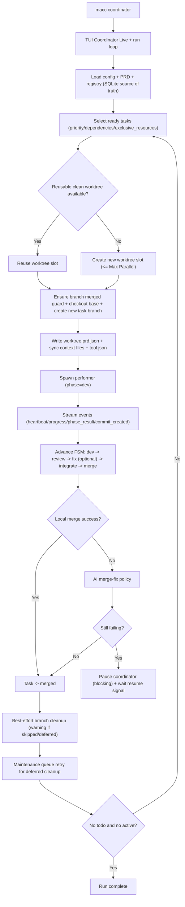
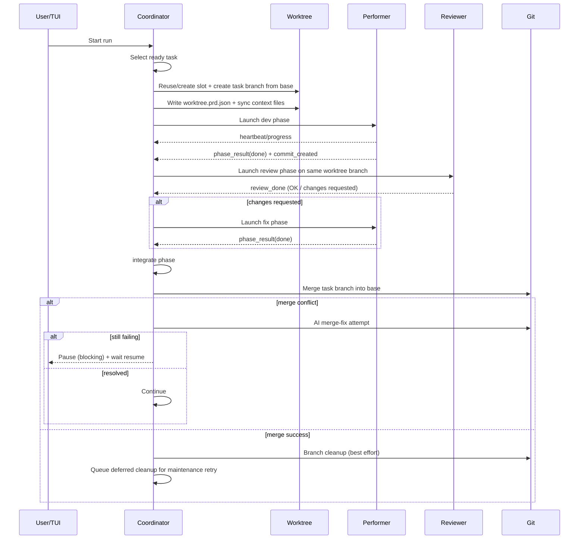

# MACC (v1)

> **MACC** (*Multi-Assistant Code Config*). A personal configuration manager for AI coding tools to provide a consistent developer experience across machines.
> **Date**: 2026-01-30
> **Status**: Draft v1 (MVP + evolutions)

---

## 1. Context & goals

### 1.1 Problem to solve
AI coding assistants each have their own configuration formats, conventions, and mechanisms (instructions, skills, agents, MCP, permissions). This leads to:
- an inconsistent experience from one machine to another,
- duplicated conventions and workflows,
- friction when starting a project, onboarding, or parallelizing work (sessions / worktrees).

### 1.2 Goals
MACC must enable:
1) **Fast installation** on Linux & Windows, then **easy initialization** on a target project.
2) A **consistent experience** across multiple AI tools via a canonical “source of truth” + tool-specific config generation.
3) A **TUI (Text-based UI)** to select tools, standards, skills, agents, MCP servers, and worktrees.
4) Support for **parallelism** (worktrees) and automation scripts like **ralph**.
5) Safe **merge/backup** mechanisms for user-level settings, with explicit consent.
6) **Remote distribution of Skills and MCP servers** via Git/HTTP links, with safe download + install into tool-specific locations (see §8.5).

### 1.3 Non-goals (v1)
- Replace the tools themselves (MACC does not re-implement the AI tools).
- Store or sync **secrets** in Git (API keys, tokens).
- Execute remote code as part of installation (no post-install scripts/hooks).
- Provide a full “CI/CD orchestrator” (MACC can help, but it is not a pipeline).

---

## 2. Functional scope

### 2.1 Target tools (v1)
MACC is designed to be **extensible**. It currently supports several major AI coding assistants via adapters, and can be extended to support others (GitHub Copilot, Cursor, Windsurf, etc.) through its plugin/adapter architecture.

### 2.2 Installation modes
- **User-level** (user configuration, plugins, MCP, global permissions)
- **Project-level** (project configuration, versioned, reproducible)

MACC must provide:
- Linux/macOS: `install.sh`
- Windows: `install.ps1`
- A `macc` command available in the PATH
- Optional GitHub bootstrap via `curl -sSL .../scripts/install.sh | bash`

---

## 3. UX: user journeys

### 3.1 Installation (machine)
**Goal**: install MACC and (optionally) detect/install AI tools.

- The user runs:
  - Linux/macOS: `./scripts/install.sh [options]` (or GitHub `curl -sSL` installer)
  - Windows: `./install.ps1 [options]`
- The script:
  - installs the `macc` binary/command,
  - installs `macc-uninstall` helper,
  - proposes installing/detecting supported tools,
  - configures user-level locations if chosen (with backup + consent).

### 3.2 Initialization (project)
In a target repo:
- `macc init`: creates `.macc/` and baseline files.
- `macc init --wizard`: interactive CLI setup (3 questions: tools, standards preset, MCP yes/no), then writes `.macc/macc.yaml`.
- `macc quickstart`: one-command happy path (prerequisites check, init/seed, then TUI or plan+apply).
- `macc` (no arguments): opens the **TUI**.
- `macc apply`: generates/installs the config into the project.
- `macc doctor --fix`: runs actionable diagnostics and applies safe auto-fixes only.
- `macc backups list/open` + `macc restore --latest`: inspect and restore backup sets (project or user-level).
- `macc clear`: asks confirmation, force-removes non-root worktrees, then removes MACC-managed project files (safe cleanup mode).

### 3.3 TUI (Text-based UI) — Rust + Ratatui
**Implementation requirement (v1)**: the TUI must be implemented in **Rust** using **Ratatui** (crate `ratatui`).

To ensure the TUI displays the configuration already present in the project and that `macc apply` applies exactly the user’s changes, the TUI and the CLI must use the same:
- canonical source of truth (`.macc/macc.yaml`),
- resolve logic,
- planning (`ActionPlan`) and preview/diff,
- apply engine (atomic writes + backups + consent gates).

Minimum screens:
1) **AI tool selection** (List of available adapters)
   - Enable/Disable tools
   - Configure tool-specific settings (via generic property editors)
   - **Skills** (catalog + selection + remote sources)
   - **Agents** selection (catalog + selection + remote sources) (if supported)
   - **Plugins** (user-level, if supported)
   - **MCP servers** selection (catalog + selection + remote sources)
2) **Standards** (global conventions / presets)
3) **Automation / Coordinator** (dispatch policy, parallelism, stale handling)
4) Worktrees (create, scopes, launch)
5) Global Settings (quiet mode, offline mode, web port)
6) Preview & Apply (summary of files to be written, backups, consent prompts)


### 3.4 Operational runbook (reference)
For production-like usage, the recommended sequence is:
1) blank machine bootstrap,
2) AI tool installation + health checks,
3) project initialization and configuration,
4) coordinator full-cycle execution,
5) deterministic failure recovery.

#### 3.4.1 Blank machine bootstrap
- Install system dependencies (`git`, `curl`, `jq`, build toolchain).
- Install MACC via `./scripts/install.sh --release` or:
  - `curl -sSL https://raw.githubusercontent.com/Brand201/macc/master/scripts/install.sh | bash -s -- --release`
- Verify binary in PATH with `macc --version`.

#### 3.4.2 Tool installation and validation
- Run `macc tui`, open `Tools`, install missing tools via install action.
- Before install, users must confirm they already have account/API credentials.
- After install, run login/API-key setup through the tool's own command flow.
- Validate with `macc doctor`.
- Generate/update tool-specific context files with prompts sent to the selected AI tool (the tool edits files directly):
  - CLI: `macc context [--tool <tool_id>]`
  - TUI: `Tools` screen, press `f` on a selected tool.

#### 3.4.3 Project init
- In target repo: `macc init`, then `macc tui`.
- Configure tools + automation/coordinator settings (reference branch, dispatch/parallel limits, timeout/staleness policy).
- Persist and materialize with `macc apply`.

#### 3.4.4 Coordinator execution
- Start full cycle with `macc coordinator`.
- Monitor with `macc coordinator status`.
- Logs must be consumed from:
  - `.macc/log/coordinator/`
  - `.macc/log/performer/`

#### 3.4.4.1 Coordinator mechanism (end-to-end diagram)





#### 3.4.5 Failure recovery
Standard recovery sequence:
1) `macc coordinator status`
2) `macc coordinator reconcile`
3) `macc coordinator unlock`
4) `macc coordinator cleanup`
5) `macc coordinator` (resume loop)

Stop flow:
- graceful stop: `macc coordinator stop --graceful`
- full stop + cleanup: `macc coordinator stop --remove-worktrees --remove-branches`

Project reset:
- `macc clear` (confirmation required, worktree cleanup executed first, only MACC-managed paths removed).

##### 3.4.5.1 Error codes + auto-retry (v1)
MACC records structured error codes for failures to distinguish origin and apply consistent remediation.

Error code schema (v1):
- `E100` Runner/Tool
  - `E101` Runner exited non-zero
  - `E102` Tool runner not found / not executable
  - `E103` Tool output malformed / parsing failed
- `E200` Capability/Contract
  - `E201` Requested unavailable tool
  - `E202` Capability guard triggered
- `E300` Worktree/FS
  - `E301` Worktree missing
  - `E302` PRD missing
  - `E303` tool.json missing
- `E400` Coordinator/Registry
  - `E401` Task registry read/write failure
  - `E402` Task state transition invalid
- `E500` Merge
  - `E501` Merge conflict
  - `E502` Merge worker failed
- `E900` Unknown/Unexpected
  - `E901` Unknown fatal error

Auto-retry controls (coordinator settings):
- `error_code_retry_list`: comma-separated list of error codes eligible for auto-retry.
- `error_code_retry_max`: max retries per task for eligible codes.

Default policy:
- `error_code_retry_list=E101,E102,E103,E301,E302,E303`
- `error_code_retry_max=2`

---

## 4. Coding standards (source of truth)

### 4.1 Global file
- `config/standards.md` (or `config/coding-standards.md`)
- Applied to all projects, then **rendered** into each tool format (e.g., Markdown system prompts, rule files, etc.).

### 4.2 Standards (table)
| Rule | Description |
|------|-------------|
| **Package Manager** | Always `pnpm`, never npm or yarn |
| **Language** | English for code, commits, docs |
| **TypeScript** | Strict mode, avoid `any` (use `unknown` or generics) |
| **Imports** | Absolute imports with `@/` alias, no relative paths |
| **Code style** | Functional/declarative, no classes |
| **Naming** | `kebab-case` folders, `camelCase` functions, `PascalCase` components |
| **React/Next.js** | Prefer Server Components, minimize `'use client'` |
| **State Management** | Prefer Zustand over React Context for global state |
| **Data Fetching** | Prefer Server Actions over API Routes |
| **UI** | Tailwind CSS + shadcn/ui |
| **Performance** | Optimize Web Vitals, WebP images, lazy loading |
| **No Barrel Imports** | Import directly, not via index |
| **No Waterfalls** | Use `Promise.all()`; avoid sequential awaits |
| **Deduplication** | Use `React.cache()` for repeated server-render calls |

---

## 5. Per-tool configuration (generation “adapters”)

### 5.1 MACC source of truth
MACC maintains a canonical configuration (e.g., `.macc/macc.yaml`) including:
- enabled tools,
- standards,
- selected skills,
- selected agents,
- selected MCP servers,
- remote sources (Git/HTTP) for skills and MCP packages,
- merge policies (user-level), worktree scopes, etc.

### 5.2 Generated project files
Each tool adapter defines which files it generates. For example:
- System prompt files (Markdown)
- Configuration files (JSON, TOML, YAML)
- Skill files
- Agent definitions
- MCP configurations
- Ignore files

---

## 6. Config build & install logic

### 6.1 `macc apply` pipeline
1) Read `.macc/macc.yaml` + presets
2) Resolve selection (tools, skills, agents, MCP, plugins)
3) **Materialize remote artifacts** (skills/MCP packages) into `.macc/cache/` (Git/HTTP) (see §8.5) using the “Fetch Unit + Selection” model (download once, install only selected subpaths)
4) Generate per-tool files and install artifacts (adapters + installer)
5) Write into the project **with backups** (safe mode, atomic writes)
6) Optional: merge user-level configs (with explicit consent)

### 6.2 Backups & consent
Any changes to user-level files must:
- create a **timestamped backup**,
- show a **diff / summary** when possible,
- prompt for confirmation (TUI) before writing.

### 6.3 Project cleanup (`macc clear`)
`macc clear` is a guarded cleanup command:
1) prompt for confirmation,
2) run worktree cleanup equivalent to `macc worktree remove --all --force`,
3) remove MACC-managed files from the current project directory.

Rules:
- Only paths tracked/managed by MACC are removed.
- Pre-existing user/project files are preserved.
- Typical removals include generated tool files and MACC project artifacts under `.macc/` (except anything not managed by MACC).
- Worktrees are cleaned first to avoid orphaned branches/process artifacts during project cleanup.

Use cases:
- Reset a project to pre-MACC state after experimentation.
- Re-run `macc init`/`macc apply` from a clean project-level baseline.

---

## 7. “BMAD Lite” workflow

### 7.1 Chain
- `/brainstorm` → `/prd` → `/tech-stack` → `/implementation-plan` → `/implement`

### 7.2 Artifacts
In a versioned folder, e.g.:
- `memory-bank/` (global)
- `memory-bank/features/<feature>/...` (per feature)

---

## 8. Skills (multi-tool)

### 8.1 Principles
- MACC provides a **catalog** of skills.
- Skills must be installable **per tool**.
- Skills support **triggers** for auto-discovery (when the tool supports it).
- Support a `--feature=<name>` flag to write into `memory-bank/features/<name>/`.

### 8.2 Development skills
| Skill | Triggers | What it does |
|-------|----------|--------------|
| `/validate` | “validate”, “run tests” | `pnpm lint` → `pnpm build` → `pnpm test:e2e` |
| `/implement` | “implement”, “let’s code”, “develop” | Read docs → plan → code → validate → review → commit |
| `/next-task` | “what’s next”, “next task” | Reads the plan and identifies the next task |
| `/refresh-context` | “where are we”, “refresh context” | Re-reads project docs (`standards.md`, `progress.md`) |
| `/update-progress` | “update progress” | Updates `progress.md` |
| `/git-add-commit-push` | “commit”, “push” | Stage, message, push |
| `/validate-update-push` | end of session | validate → update-progress → commit → push |

### 8.3 Utility skills
| Skill | Triggers | What it does |
|-------|----------|--------------|
| `/db-check` | After DB changes | Checks Supabase advisors (perf/security) |
| `/security-check` | Before commit | Red-team style security audit |
| `/seo-check` | Page work | SEO + accessibility + Web Vitals audit |
| `/permissions-allow` | Setup | Applies standard permissions |
| `/design-principles` | UI work | Minimal design system (Linear/Notion/Stripe-like) |
| `/validate-quick` | Before commits | lint + build (fast) |
| `/sync-config` | Manual | Sync local config → repo |

### 8.4 Auto-discovery
- Some skills should be auto-suggested/executed based on context (DB, SEO, security) when the tool supports it.
- Otherwise: clear documentation for “when to use it”.

### 8.5 Remote Skills and MCP sources (NEW)
MACC must support selecting skills and MCP servers that live in **remote repositories or servers**.
When a user selects a skill or MCP entry for a tool, MACC must be able to:
- fetch it (Git or HTTP),
- verify it (best-effort),
- install it into the correct tool locations during `macc apply`.

#### 8.5.1 Supported source kinds
A skill/MCP reference can come from:
- **Git** (recommended): a repo URL + pinned `rev` (commit SHA or tag)
- **HTTP(S)**: zip/tar/single file downloads (checksum strongly recommended)
- **Local** (optional): local folder path (useful for development)

**Fetch Unit + Selection model**
- **Fetch Unit**: the thing you download once (git repo at ref, http archive/file). Materialized into `.macc/cache/<key>/...`.
- **Selection**: per skill/MCP entry, defines the subpath inside the fetch unit to install. Multiple selections can share one fetch unit (download once, install many).

**Catalogs (versioned)**
- Default catalogs live in `catalog/skills.catalog.json` and `catalog/mcp.catalog.json` at repo root; `macc init` seeds them if missing.
- Users can add/modify entries via CLI; additional catalogs can be layered later (TUI/remote index planned).

#### 8.5.2 Canonical config additions (conceptual)
The canonical config must be able to represent an artifact reference:
- `id` (stable identifier)
- `kind`: `git | http | local`
- `url` (git or http)
- `rev` (git only; prefer pinned commit SHA for reproducibility)
- `subpath` (optional; points inside repo; used at install time, not in the cache key)
- `checksum` (http only; recommended, e.g., `sha256:...`)

#### 8.5.3 Package manifest requirement
Remote content must be **data-only packages** (no scripts) and include a manifest that tells MACC what to install.
Required: `macc.package.json` at the package root.

Minimal manifest fields:
- `type`: `skill` or `mcp`
- `id`, `version`
- `targets`: mapping of tool → list of file installs (src → dest)

Example (skill):
- install `tool_a/*` → `.tool_a/skills/<id>/...`
- install `tool_b/*` → `.tool_b/skills/<id>/...`

Example (mcp):
- provide a JSON object describing the MCP server and how to merge into the project or user scope (with consent).

#### 8.5.4 Cache and reproducibility
- MACC stores fetched artifacts under `.macc/cache/` (cache key ignores subpaths; one fetch unit can serve multiple selected subpaths).
- `.macc/cache/` must be added to `.gitignore`.
- Git sources should be pinned to commits/tags; HTTP sources should provide a checksum.
- `macc apply --offline` (v2+) should reuse cache if present.

#### 8.5.5 Security boundaries
- No post-install scripts. No executing downloaded code.
- Never write real secrets: MCP env values must be placeholders like `${ENV_VAR}`.
- Secret scanning should run on generated outputs prior to writing.

#### 8.5.6 CLI/TUI behavior
- TUI: allow “Add by URL” for skills/MCP entries.
- CLI (proposed, v1+):
  - `macc catalog add-source --kind git --url <repo> --rev <tag|sha>`
  - `macc add skill --tool <tool> --id <id> --url <...> [--rev ...]`
  - `macc add mcp --tool <...> --id <id> --url <...> [--rev ...]`
  - These commands update `.macc/macc.yaml` and then `macc apply` installs.

---

## 9. Custom agents

### 9.1 BMAD Lite agents (product discovery)
| Agent | Model | Expertise | Used by |
|-------|-------|-----------|---------|
| `analyst` | inherit | Discovery, market analysis, ideation | `/brainstorm` |
| `product-manager` | inherit | Needs, user stories, prioritization | `/prd` |
| `architect` | heavy | Tech decisions, system design, planning | `/tech-stack`, `/implementation-plan` |

### 9.2 Development agents
| Agent | Model | Expertise | Triggered when |
|-------|-------|-----------|----------------|
| `code-reviewer` | inherit | Quality, security, best practices | after changes, during `/implement` |
| `nextjs-developer` | inherit | Next.js 14+, RSC, Server Actions | Next.js work |
| `supabase-developer` | inherit | Postgres, Auth, RLS | DB/auth |
| `prompt-engineer` | inherit | Prompts, context extraction | prompts & content |
| `seo-specialist` | inherit | SEO, accessibility, Web Vitals | pages/content |

### 9.3 Rules
- `model: inherit` by default, with exceptions (e.g., `architect`).
- MACC must render agents in the tool’s format.
- For tools that do not support “agent files”, MACC must provide a fallback:
  - dedicated skills,
  - or instruction sections inside the system prompt.

---

## 10. Plugins (user-level)

### 10.1 Principle
- Plugins are enabled **only** at user-level.
- MACC must:
  - enable/disable plugins,
  - show their impact (capabilities),
  - handle conflicts/versions (at minimum: warnings).

### 10.2 Proposed plugins
| Plugin | What it does |
|--------|--------------|
| `mgrep` | Semantic search via embeddings |
| `frontend-design` | Generates distinctive production-ready UI |
| `code-review` | Automated code review + checks |
| `code-simplifier` | Simplifies and refines code |
| `typescript-lsp` | TS language server integration |
| `security-guidance` | Security best practices + detection |
| `context7` | Up-to-date library docs |

---

## 11. MCP servers (optional)

### 11.1 Principle
MCP servers extend capabilities via external services and are **merged automatically** during install (existing servers preserved).
- MACC maintains templates **without secrets**.
- Installation/activation can:
  - write a project config (`.mcp.json`) if supported,
  - or merge user-level config (with backup + consent).
- API keys are entered **afterwards** (manual), never committed.

### 11.2 Remote distribution
MCP servers may be provided via remote packages (Git/HTTP) using §8.5. The package manifest must specify:
- the MCP server definition (command/args/env placeholders),
- the merge destination (project `.mcp.json` and/or user config in later milestones).

---

## 12. Automation scripts

### 12.1 Ralph (autonomous)
- `scripts/ralph.sh <n>`

**Sequence**:
1) switch to `ralph` branch (or dedicated worktree)
2) `/next-task` → `/implement` → `/validate` → `/update-progress` → `/git-add-commit-push`
3) loop N times (or stop)

**Prereqs**:
- `memory-bank/` (project docs)
- `progress.md` for tracking

### 12.2 Coordinator + Performer (worktree orchestration)

MACC automation is split into:
1) Native Rust coordinator control-plane (primary path): reads PRD, maintains `.macc/automation/task/task_registry.json`, dispatches READY tasks by constraints (`priority`, `dependencies`, `exclusive_resources`, `category`, `id`), supervises performers asynchronously, and tracks transitions.
2) `coordinator.sh` (thin wrapper): forwards to native Rust coordinator actions.
3) `performer.sh` (worktree-level executor): runs in a single worktree and delegates to the tool-specific runner from `.macc/tool.json`.
4) `runners/<tool>.performer.sh`: tool-specific execution strategy.

Observability:
- Coordinator and performer runtime logs are centralized in `.macc/log/`:
  - `.macc/log/coordinator/`
  - `.macc/log/performer/`
- TUI includes a dedicated **Logs** screen to inspect recent `.md/.log/.txt` files without leaving the interface.

Coordinator settings are persisted in `.macc/macc.yaml` under `automation.coordinator` and can be edited in TUI (Automation screen) or overridden by CLI flags/env.

### 12.4 Session strategy (tool runners)

Tool sessions are managed at project level in:
- `.macc/state/tool-sessions.json`

Model:
- Per tool, MACC keeps:
  - `sessions` mapping (scope key -> `session_id`)
  - `leases` mapping (`session_id` -> ownership/heartbeat/status)
- Default scope is **worktree** (`scope: worktree`), so parallel worktrees do not share a session.

Lease/occupancy rules:
- A session is considered occupied when:
  - lease status is `active`,
  - owner worktree is different and still alive,
  - heartbeat is fresh (TTL-based).
- If occupied, runner must not reuse it.
- If stale/missing owner, runner may reclaim it.
- On runner exit, lease is marked `released` (session mapping remains reusable).

Tool-specific session acquisition:
- Codex: parse `session id:` from output; resume with configured resume command.
- Gemini: optional discover command (`--list-sessions`) + resume (`--resume <UUID>`).
- Claude: generated session IDs (e.g., `uuidgen`) + resume via `--session-id <ID>`.

Important behavior:
- If no reusable session exists for the tool/scope, create a new one.
- If all known sessions are occupied, create a new one.
- Session IDs are reused in serial runs for the same worktree/scope.
- Worktree pool reuse keeps session continuity because the scope key (worktree path) remains stable.

### 12.3 Coordinator command

- `macc coordinator` runs full-cycle mode by default (`run`).
- Full-cycle loop: `sync -> dispatch -> advance -> reconcile -> cleanup` until convergence.
- `macc coordinator [run|dispatch|advance|resume|sync|status|reconcile|unlock|cleanup]`
- `run`, `dispatch`, `advance`, `reconcile`, and `cleanup` are handled natively in Rust.
- Worktrees are reused as worker slots (not task-coupled names): once a task is merged, the slot is reset to reference, moved to a fresh branch, refreshed for the new task, then relaunched.
- New worker worktrees are created only when no reusable slot is available; pool size is bounded by `max_parallel`.
- Coordinator options can override config at runtime:
  - `--prd`, `--coordinator-tool`
  - `--tool-priority`, `--max-parallel-per-tool-json`, `--tool-specializations-json`
  - `--max-dispatch`, `--max-parallel`, `--timeout-seconds`
  - `--phase-runner-max-attempts`
  - `--stale-claimed-seconds`, `--stale-in-progress-seconds`, `--stale-changes-requested-seconds`, `--stale-action`
  - `--merge-ai-fix`, `--merge-fix-hook`, `--merge-job-timeout-seconds`, `--merge-hook-timeout-seconds`
  - `--ghost-heartbeat-grace-seconds`, `--dispatch-cooldown-seconds`
  - `--json-compat`, `--legacy-json-fallback`
  - `--error-code-retry-list`, `--error-code-retry-max`
  - `--cutover-gate-window-events`, `--cutover-gate-max-blocked-ratio`, `--cutover-gate-max-stale-ratio`
- Coordinator settings are persisted in `.macc/macc.yaml` under `automation.coordinator`.
- TUI (Automation Settings screen) allows visual editing of all 27 coordinator parameters.
- Heartbeat events update `task_runtime.last_heartbeat` from `events.jsonl`.
- Stale heartbeat policy is enforced during control-plane runs; can be reset, blocked, or requeued based on `stale_action`.
- Extra raw args with `--` are for coordinator subcommands that require raw passthrough args.
- Optional VCS automation hook:
  - `COORDINATOR_VCS_HOOK=/path/to/hook.sh`
  - Hook modes called by `advance`: `pr_create`, `review_status`, `ci_status`, `queue_status`, `merge_status`
  - Hook receives task context via env (`MACC_TASK_ID`, `MACC_TASK_WORKTREE`, `MACC_TASK_BRANCH`, `MACC_TASK_BASE_BRANCH`, `MACC_TASK_PR_URL`, `MACC_TASK_TOOL`).
  - Hook returns JSON object on stdout (mode-specific fields such as `pr_url`, `decision`, `status`, `reason`).
  - Without hook, coordinator can use local fallback merge when `COORDINATOR_AUTOMERGE=true`.

### 12.3.1 Realtime orchestrator target (next evolution)

To remove ambiguity between "task dispatched" and "task actually running", MACC targets a split model:

- Workflow state remains in `task.state` (`todo`, `in_progress`, `pr_open`, ...).
- Runtime process lifecycle moves to `task.task_runtime.status` (`dispatched`, `running`, `phase_done`, `failed`, `stale`).

Migration direction:

1. strict transition table in core (single source of truth),
2. versioned event contract (JSON schema),
3. heartbeat event consumer now updates `task_runtime.last_heartbeat` (cursor is in-memory today),
4. control-plane loop split (scheduler / event monitor / runtime monitor),
5. TUI live timeline + blocking error gate (Retry / Skip / Stop / Logs).

Reference short design doc:
- `docs/COORDINATOR_REALTIME.md`

---

### 12.5 Global settings

MACC maintains global preferences at the project level in `.macc/macc.yaml` under the `settings` key. These settings control the behavior of the MACC binary itself.

Available settings:
- `quiet`: Suppress all non-essential output from AI tools and MACC internal operations (e.g., fetch logs).
- `offline`: Disable all remote fetching and updates.
- `web_port`: The port number for the MACC web interface (default: 3450).

Control hierarchy:
1. CLI global flags (`--quiet`, `--offline`, `--web-port`)
2. Project configuration (`.macc/macc.yaml`)
3. Built-in defaults

## 13. Worktrees & parallelism

### 13.1 Goal
Enable multiple parallel sessions:
- multiple instances of the same tool,
- multiple different tools simultaneously.

### 13.2 Conventions
- Worktree folder: `.macc/worktree/` (default)
- Branch naming: `ai/<tool>/<slug>-<NN>`
- Session state folder: `.macc/state/` (includes `tool-sessions.json`)

### 13.3 Proposed commands
- `macc worktree create <slug> --tool <tool> --count N --base main --scope "glob,glob" --feature X`
- `macc worktree list`
- `macc worktree open <id> [--editor code] [--terminal]`
- `macc worktree run <id>` (launches the tool for that worktree)
- `macc worktree exec <id> -- <cmd...>`
- `macc worktree apply <id>|--all`
- `macc worktree status <id>`
- `macc worktree doctor <id>`
- `macc worktree merge <id>|--all --into main`
- `macc worktree remove <id>`
- `macc worktree prune`

**Worktree status (current implementation):**
- ✅ `macc worktree create` (creates git worktrees, writes `.macc/worktree.json`, optional scope, applies tool config)
- ✅ `macc worktree list` (uses `git worktree list --porcelain`)
- ✅ `macc worktree status` (shows the current worktree and totals)
- 🧪 `macc worktree open <id> [--editor <cmd>] [--terminal]` (opens a worktree)
- 🧪 `macc worktree apply <id>|--all` (applies configuration in worktree(s))
- 🧪 `macc worktree doctor <id>` (runs doctor checks in a worktree)
- 🧪 `macc worktree exec <id> -- <cmd...>` (executes a command inside a worktree)
- ✅ `macc worktree run <id>` (runs performer automation inside the target worktree)
- ✅ `macc worktree remove <id|path> [--remove-branch]` (removes a worktree, optionally deletes its branch)
- ✅ `macc worktree remove --all [--remove-branch]` (removes all worktrees except the main one, optionally deletes their branches)
- 🧪 `macc worktree prune` (prunes stale worktrees)
- ⏳ All other `macc worktree ...` commands are planned but not implemented yet.

**Coordinator pool mode (current implementation):**
- `WORKTREE_POOL_MODE=true` (default): coordinator may reuse an idle compatible worktree.
- Compatibility checks include: selected tool, base branch, optional task scope, clean worktree state, and no active task binding.
- On reuse, `worktree.prd.json` is rewritten for the new task and the existing worktree-scoped session can be reused.

### 13.4 Exact `create` behavior
1) Derive IDs/branches (e.g., `feature-tool-01`, `ai/tool/feature-01`)
2) `git worktree add -b ... .worktrees/... <base>`
3) In each worktree, create:
   - `.macc/worktree.json` (id, tool, scope, feature, base)
   - `.macc/scope.md`
   - `.macc/selections.lock.json` (copy of the selection)
4) Apply config:
   - `macc apply --cwd <worktree> --tools <tool>`

### 13.5 Anti-conflict rule: “one worktree = one scope”
- MACC should encourage separation by: feature / code area / task type
- Optional locks (e.g., `pnpm-lock.yaml`, migrations):
  - block, or require confirmation

---

## 14. Security & privacy

### 14.1 Secrets
- Strict prohibition on committing secrets.
- Templates with placeholders only.
- Robust `.gitignore` entries (including `.macc/cache/`).

### 14.2 Permissions
- MACC must make explicit:
  - auto-approved commands (pnpm dev/build/test…),
  - forbidden commands by default (e.g., `rm -rf`, `curl|sh`).
- Any permission escalation must require consent.

---

## 15. Technical requirements

### 15.1 OS compatibility
- Linux (Ubuntu/Debian) minimum
- Windows (PowerShell)
- macOS (bonus, compatible with install.sh)

### 15.2 Implementation & dependencies
- **Primary implementation language: Rust (stable)**.
- **TUI: Ratatui** (`ratatui`) + typical terminal stack (`crossterm`).
- Git is required.
- Prefer distributing **prebuilt binaries**; Rust toolchain should be required only for contributors/build-from-source.

### 15.3 Performance
- `macc apply` should be fast (< 1s on a standard project excluding downloads).
- Downloads are cached and should be incremental.

---

## 16. Documentation
- `README.md` (user guide)
- `CONTRIBUTING.md` (engineering quality baseline)
- `CHANGELOG.md` (versioned release notes)
- `SECURITY.md` (vulnerability disclosure and support window)
- `docs/README.md` (documentation index, active vs historical docs)
- [Catalog Management](docs/CATALOGS.md): skills/MCP catalogs, imports, remote search
- `docs/TOOL_ONBOARDING.md` (unified “add tool end-to-end” guide)
- `docs/COMPATIBILITY.md` (OS + Rust compatibility policy)
- `docs/RELEASE.md` (SemVer/tag/release process)
- Additional guides: installation, init/apply, worktrees, MCP, Ralph

---

## 17. Tree structure (updated)
```
macc/
  crates/
    macc-core/
      src/
        config/              # parse + validate canonical config
        catalog/             # skill/mcp catalog, remote sources, indexes
        resolve/             # canonical -> resolved selections
        tool_api/            # ToolAdapter trait + registry
        plan/                # ActionPlan, scopes, diffs, consent gates
        fetch/               # git/http fetchers (into .macc/cache)
        packages/            # macc.package.json parsing + validation
        install/             # package -> tool install mapping (plan actions)
        io/                  # atomic write, backup, filesystem ops
        merge/               # json/toml merge + policies
        security/            # secret scanning, deny patterns
        doctor/              # diagnostics framework
    macc-adapters/           # tool-specific planners
    macc-cli/                # clap commands, calls core
    macc-tui/                # ratatui state machine (later)
```
---

## 18. Acceptance criteria (MVP)

### 18.1 Installation
- ✅ Linux: `install.sh` installs `macc` and works non-interactively (flags) or interactively (TUI).
- ✅ Windows: `install.ps1` installs `macc`.
- ✅ `macc --version` and `macc --help` work.

### 18.2 Project apply
- ✅ `macc init` creates `.macc/` + minimal config.
- ✅ `macc plan` shows a preview without writing.
- ✅ `macc apply` generates tool config safely (atomic + backups).
- ✅ `macc clear` asks confirmation, cleans non-root worktrees first, then removes MACC-managed project artifacts without deleting pre-existing files/directories.
- ✅ `.macc/backups/<timestamp>/...` contains backups of overwritten files.
- ✅ No secrets are written into the repo.
- ✅ User-level modifications require consent (and are disabled by default in early milestones).

### 18.3 Remote artifacts (Skills/MCP) (NEW)
- ✅ A skill/MCP can be referenced by Git/HTTP link in `.macc/macc.yaml`.
- ✅ `macc apply` fetches artifacts into `.macc/cache/` and installs files into the correct tool locations.
- ✅ `.macc/cache/` is gitignored.
- ✅ HTTP downloads can be verified by checksum when provided; Git sources can be pinned to a commit/tag.

### 18.4 Worktrees
- ✅ `macc worktree create <slug> --tool <tool> --count 2` creates 2 worktrees, applies config, and writes `.macc/worktree.json`.
- ✅ `macc worktree list` shows worktrees.
- ✅ `macc worktree prune` removes merged ones (or those removed in git).

### 18.5 Security
- ✅ No API key is written into the repo.
- ✅ Remote packages are data-only; no scripts executed.
- ✅ User-level modifications = backup + consent.

---

## 19. Roadmap (proposed)
- **v0.1**: init/plan/apply + standards + 2 skills + worktree create/list/apply
- **v0.2**: full TUI (Rust + Ratatui) + ralph + MCP templates + consented merges. See [Acceptance Checklist](docs/v0.2-checklist.md).
- **v0.3**: **remote catalog + git/http package fetch** for skills/MCP
- **v1.0**: stability, docs, modules, skill/agent marketplace (indexes + signatures), broader tool support

---

## 20. References & Prior Art
- Codex (OpenAI)
- Gemini Code Assist
- Claude Code
- Copilot
