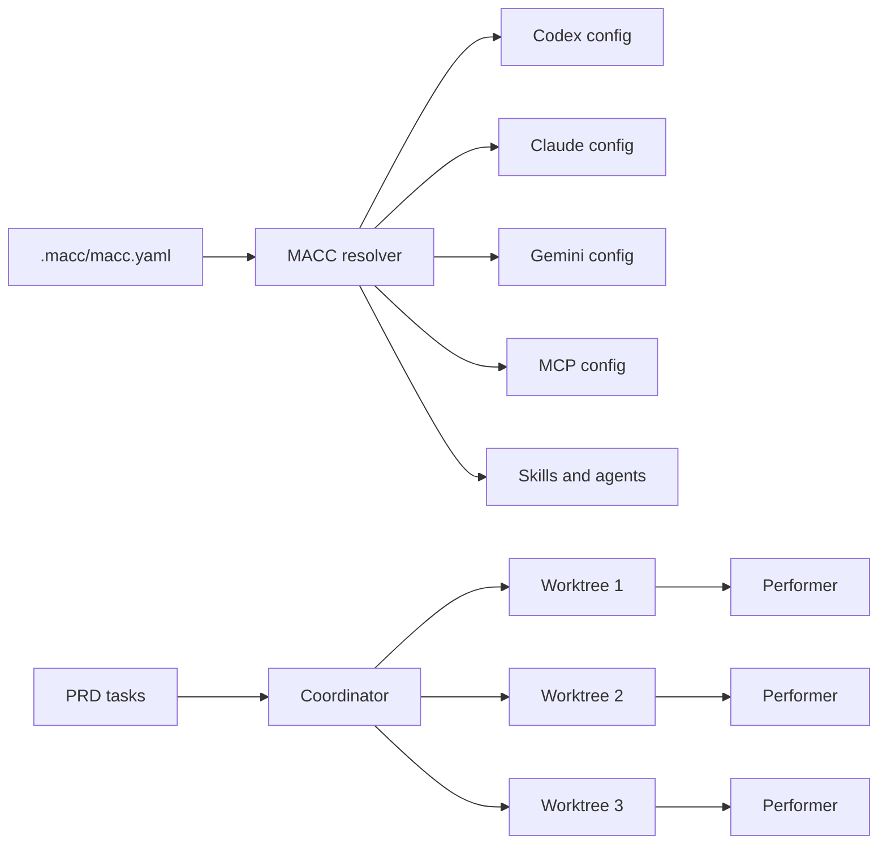

# MACC

> **Multi-Assistant Code Config** one canonical config, many AI coding tools, coordinated worktrees.

MACC manages tool configuration across Claude Code, Codex, Gemini CLI, and others from a single source of truth, then coordinates them as autonomous agents running parallel tasks across git worktrees.

If you run more than one AI coding tool on the same codebase, or want to leave tasks running unattended across multiple branches, this is the layer that keeps it coherent.

<p align="center">
  <a href="#30-second-quickstart">Quickstart</a> ·
  <a href="#why-macc">Why MACC?</a> ·
  <a href="#core-workflows">Workflows</a> ·
  <a href="#troubleshooting">Troubleshooting</a> ·
  <a href="#documentation">Docs</a>
</p>

---

## 30-second quickstart

```bash
# Install
curl -sSL https://raw.githubusercontent.com/Brand201/macc/master/scripts/install.sh | bash -s -- --release

# Inside your git repository
cd your-project
macc quickstart
```

`macc quickstart` guides you through:

1. detecting your installed AI tools,
2. selecting a tool adapter,
3. installing starter skills,
4. creating or selecting a first task,
5. applying generated config,
6. running diagnostics,
7. starting the coordinator.

```bash
# Then check what is happening
macc status

# Open the local Web UI
macc web
```

---

## Why MACC?

AI coding assistants each require different configuration files, instruction formats, skills, agents, MCP settings, and permission models.

| Without MACC | With MACC |
|---|---|
| Duplicated tool configs | One canonical config (`macc.yaml`) |
| Different setup per machine | Reproducible project setup |
| Manual worktree orchestration | Coordinator-driven parallelism |
| Opaque failures | `macc doctor` and `macc status` |
| Hard-to-share conventions | Versioned standards and skills |

---

## Visual overview



---

## Core workflows

| I want to... | Command |
|---|---|
| Start from scratch | `macc quickstart` |
| Initialize manually | `macc init` |
| Preview generated changes | `macc plan` |
| Apply tool configs | `macc apply` |
| Check what is broken | `macc doctor` |
| See what is happening | `macc status` |
| Open the TUI | `macc` or `macc tui` |
| Open the Web UI | `macc web` |
| Run the coordinator | `macc coordinator run` |
| Create worktrees | `macc worktree create <slug> --tool <tool>` |
| Run a skill | `macc run <skill>` |

---

## First-run readiness

`macc quickstart` and `macc doctor` track progress through a readiness ladder:

```text
1. Project initialized        ✅
2. Tool adapter selected      ✅  codex
3. Config applied             ✅
4. PRD/task available         ✅  QS-001
5. Git identity configured    ✅
6. Coordinator running        ✅
7. Performer connected        ✅
8. First task dispatched      ✅
```

If anything is blocked:

```bash
macc doctor
```

`macc doctor --json` emits structured findings with stable error codes and recommended actions.

---

## Installation

**From GitHub (recommended):**

```bash
curl -sSL https://raw.githubusercontent.com/Brand201/macc/master/scripts/install.sh | bash -s -- --release
```

**From a local clone:**

```bash
git clone https://github.com/Brand201/macc.git
cd macc
./scripts/install.sh --release
```

**Installer flags:**

| Flag | Effect |
|---|---|
| `--release` | Build optimized binary |
| `--prefix <dir>` | Install into a custom directory |
| `--system` | Install to `/usr/local/bin` (uses `sudo`) |
| `--no-path` | Skip updating shell profile `PATH` |
| `--ref <ref>` | Branch, tag, or commit (default: `master`) |

**Uninstall:**

```bash
macc-uninstall
```

---

## Troubleshooting

### No coordinator is running

```text
No MACC coordinator is running.
```

Start one:

```bash
macc coordinator run
```

Then check status:

```bash
macc status
```

### Git identity is missing

```text
Git identity is missing.
```

Fix:

```bash
git config --global user.name "Your Name"
git config --global user.email "you@example.com"
```

Or let MACC do it:

```bash
macc doctor --fix --git-name "Your Name" --git-email "you@example.com"
```

### No ready task found

```bash
macc quickstart --starter-task
```

Or sync from your PRD:

```bash
macc coordinator sync-prd
```

<details>
<summary>Advanced coordinator recovery</summary>

```bash
macc coordinator status
macc coordinator sync-prd
macc coordinator reconcile
macc coordinator unlock
macc coordinator cleanup
macc coordinator run
```

</details>

---

## Interfaces

MACC has three surfaces that share the same state model.

### CLI

```bash
macc quickstart         # guided first-run flow
macc status             # runtime overview
macc doctor             # diagnostics and readiness
macc watch              # live TUI observer
macc run <skill>        # run a skill
```

All commands support `--quiet`, `--offline`, and `--json` where applicable.

### TUI

```bash
macc tui
```

Screens: Home (with readiness ladder), Tools, Automation/Coordinator, Coordinator Live, Skills, MCP, Logs, Observer.

Navigation: `h` Home · `t` Tools · `o` Automation · `v` Coordinator Live · `m` MCP · `g` Logs · `?` Help · `q`/`Esc` Back.

### Web UI

```bash
macc web          # serves at localhost:3450
```

The dashboard shows the readiness ladder, queue summary, active workers, and throttled tools via `GET /api/v1/snapshot`.

Development:

```bash
cd web && npm install && npm run dev  # frontend at localhost:5173
macc web                               # API at localhost:3450
```

---

## Core commands

<details>
<summary>Project lifecycle</summary>

```bash
macc quickstart [-y] [--tool <tool>] [--starter-task] [--start-coordinator] [--check-only]
macc init [--force] [--wizard] [--profile <name>]
macc plan [--tools t1,t2] [--json] [--explain]
macc apply [--tools ...] [--dry-run] [--allow-user-scope] [--json]
macc doctor [--fix] [--json] [--git-name "Name"] [--git-email "email"] [--coordinator]
macc status [--json] [--watch] [--events N] [--verbose]
macc watch                     # alias for status --watch
```

</details>

<details>
<summary>Coordinator</summary>

```bash
macc coordinator run                # launch review, then choose TUI / Web / headless
macc coordinator run --client tui   # skip prompt, open TUI coordinator view
macc coordinator run --client web   # skip prompt, run headless + print dashboard URL
macc coordinator run --client none  # skip prompt, run headless (alias: --no-client)
macc coordinator status
macc coordinator sync-prd           # reconcile tasks from PRD
macc coordinator reconcile
macc coordinator unlock
macc coordinator cleanup
macc coordinator stop [--graceful] [--remove-worktrees]
macc coordinator audit-prd -- --tool claude
```

`macc coordinator run` in an interactive terminal shows a **Coordinator Launch Review** — a summary of project, execution settings, and reference branch — before asking which client to open.

Runtime overrides: `--max-parallel`, `--max-dispatch`, `--tool-priority`, `--disable-testing`, `--disable-review`.

**Reference branch safety:**

```bash
macc coordinator run --preflight-only           # check and exit
macc coordinator run --allow-dirty-reference    # bypass dirty check for this run
macc coordinator run --create-reference-branch --reference-branch-base main
```

</details>

<details>
<summary>Worktrees</summary>

```bash
macc worktree create <slug> --tool <tool> [--count N] [--base BRANCH]
macc worktree list
macc worktree status
macc worktree open <id>
macc worktree run <id>
macc worktree remove <id> [--force]
macc worktree prune
```

</details>

<details>
<summary>Skills</summary>

```bash
macc run <skill> [--tool <tool>] [--dry-run] [--watch] [--json] [--yes]
macc skills list [--tool <tool>]
macc skills show <skill>
macc skills explain <skill>
macc skills doctor
```

Skills are defined in `.macc/skills/*.yaml`. Risk levels: safe, caution, dangerous. Caution prompts for confirmation; dangerous requires typing `YES`.

</details>

<details>
<summary>Save / restore bundles</summary>

```bash
macc save <name> [--overwrite] [--description "..."]
macc restore [<name>] [--latest] [--dry-run] [--apply]
macc config save <name>
macc config restore <name>
macc config list
```

</details>

---

## Error codes

| Code | Meaning | Retryable |
|---|---|---|
| `MACC-GIT-IDENTITY-MISSING` | Git identity not configured | Fix with `macc doctor --fix` |
| `MACC-COORDINATOR-IPC-MISSING` | No coordinator running | Start with `macc coordinator run` |
| `MACC-COORDINATOR-IPC-STALE` | Stale coordinator socket | Run `macc doctor --fix --coordinator` |
| `MACC-TASK-NONE-READY` | No dispatchable tasks | Create with `macc quickstart --starter-task` |
| `MACC-TOOL-NOT-RUNNABLE` | Tool not authenticated | Run tool login, then `macc doctor` |
| `MACC-WORKTREE-DISK-LOW` | Insufficient disk for worktrees | Free space or reduce `max_parallel` |
| `MACC-CONFIG-NOT-APPLIED` | Config not applied | Run `macc apply` |
| `E701` | Reference branch not found | Create branch or update config |
| `E702` | Reference branch has uncommitted changes | Commit, stash, discard, or use `--allow-dirty-reference` |
| `E703` | Reference branch inspection failed | Run `macc doctor` |
| `E704` | Reference branch creation declined | Re-run and choose a branch |
| `E705` | Reference branch creation failed | Fix Git error and retry |
| `E706` | Invalid reference branch name | Correct `automation.coordinator.reference_branch` |
| `E707` | Bare repository unsupported | Run MACC in a normal worktree |
| E101–E901 | Coordinator / performer runtime codes | See `docs/ERRORS.md` |

### Coordinator reference branch safety

Before running the coordinator, MACC verifies that the configured reference branch exists locally and is clean. If the branch is missing, MACC can create it after confirmation. If the branch has uncommitted changes, MACC blocks by default.

```yaml
# automation.coordinator in macc.yaml
reference_branch: main
require_clean_reference_branch: true   # MVP setting

# Full policy (optional)
reference_branch_preflight:
  enabled: true
  missing_branch_policy: prompt     # prompt | fail | create
  dirty_policy: block               # block | warn | allow
  include_untracked: true
```

---

## Key paths

| Path | Purpose |
|---|---|
| `.macc/macc.yaml` | Canonical config |
| `.macc/state/coordinator.sqlite` | Coordinator runtime ledger |
| `.macc/state/onboarding.json` | Quickstart progress state |
| `.macc/log/coordinator/` | Coordinator events and logs |
| `.macc/log/performer/` | Per-worktree performer logs |
| `.macc/log/run/` | Skill run logs |
| `.macc/skills/` | Local skill definitions |
| `.macc/backups/` | Project backup sets |
| `~/.macc/profiles/` | Saved configuration profiles |

---

## Documentation

| Topic | Doc |
|---|---|
| Full architecture and specification | `MACC.md` |
| Release notes | `CHANGELOG.md` |
| Coordinator resilience and recovery | `docs/COORDINATOR_RESILIENCE.md` |
| Canonical config schema | `docs/CONFIG.md` |
| ToolSpec format | `docs/TOOLSPEC.md` |
| Adding a new tool | `docs/TOOL_ONBOARDING.md` |
| Web API | `docs/WEB_API_CONTRACT.md` |
| Error codes | `docs/ERRORS.md` |
| Security | `SECURITY.md` |
| Contribution workflow | `CONTRIBUTING.md` |

---

## Security model

MACC is local-first.

- No secrets are committed.
- Remote packages are data-only.
- User-level writes require backup and consent (`--allow-user-scope` + interactive confirmation).
- Web UI binds to `localhost` by default.
- Mutating Web API requests are audit-logged.
- Secret scanning blocks unsafe generated output.
