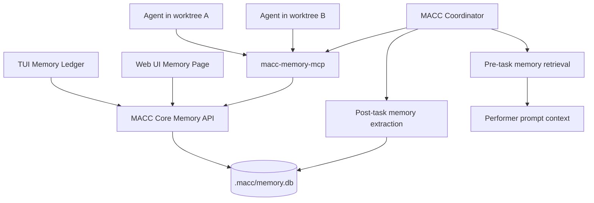
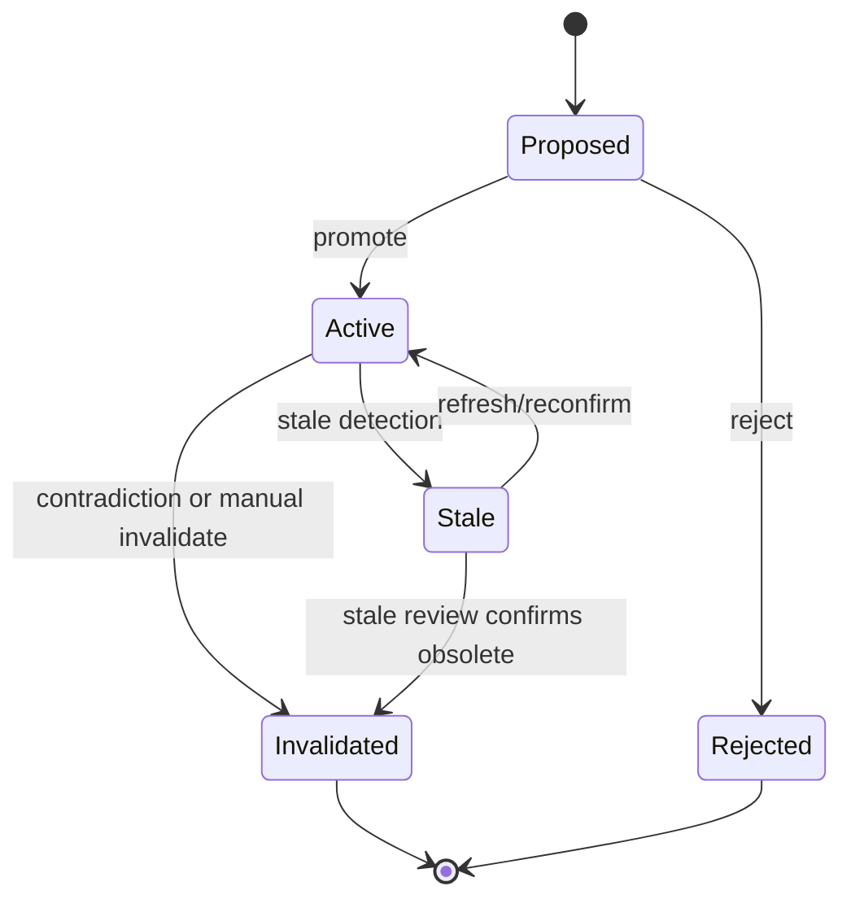
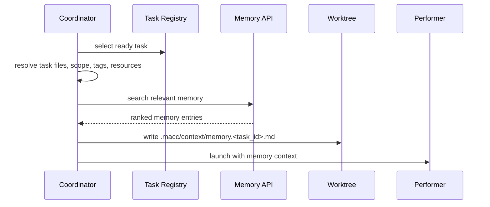
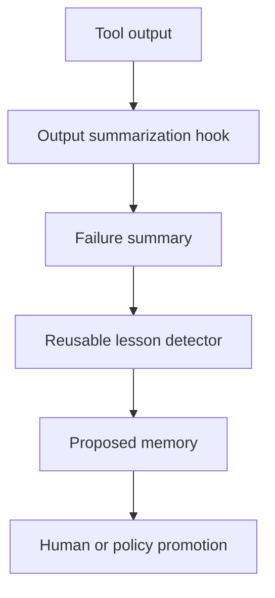

# MACC O2 — SQLite Shared Memory (Cross-Agent Memory Ledger)

**Project:** MACC — Multi-Assistant Code Config  
**Motif:** O2. SQLite Shared Memory / Cross-Agent Memory  
**Status:** Detailed design proposal  
**Language:** English  
**Target:** MACC coordinator, worktree orchestration, MCP integration, TUI, Web UI, and local automation runtime

---

## 1. Executive Summary

MACC already focuses on making multiple AI coding tools behave consistently across machines, projects, worktrees, and local automation flows. Its coordinator can dispatch tasks across isolated git worktrees, run performers, observe logs, reconcile commits, and expose operational state through the TUI and local Web UI.

The **O2 SQLite Shared Memory** motif extends that architecture with a local, structured, queryable knowledge layer:

```text
.macc/memory.db
```

This database becomes a **Cross-Agent Memory Ledger**. It allows agents working in separate worktrees to share concise, evidence-backed discoveries without sharing raw chat history or polluting prompts with large logs.

The goal is simple:

> When one agent learns something important about the project, future agents should be able to benefit from it before they edit related files.

Examples:

- “Do not use DB connection pool size > 5; local Docker Postgres exhausts sockets.”
- “The auth middleware breaks if cookies are read after response headers are committed.”
- “This Playwright test requires the seeded organization fixture.”
- “The project migrated away from API Routes; use Server Actions for this path.”
- “This dependency version has a deprecated option; use the new config key.”

The Memory Ledger should be exposed through a dedicated local MCP server, integrated into the coordinator lifecycle, surfaced in the TUI/Web UI, and protected by strict safety policies around secrets, stale knowledge, and human promotion.

---

## 2. Why This Matters for MACC

### 2.1 Existing MACC strength

MACC's current architecture emphasizes:

- canonical configuration under `.macc/macc.yaml`,
- tool-specific adapter generation,
- coordinator-driven task execution,
- worktree-based parallelism,
- logs under `.macc/log/`,
- task registry and runtime state,
- MCP server selection and installation,
- Web UI and TUI observability,
- security boundaries around secrets, generated files, and remote packages.

This makes MACC a natural host for local cross-agent memory.

### 2.2 Existing MACC gap

Worktree isolation prevents code conflicts, but it also isolates learning.

A typical failure mode:

1. Agent A works in `worktree/auth-01`.
2. Agent A discovers a hidden constraint in `src/middleware.ts`.
3. The discovery only appears in logs, a final note, or an unstructured commit message.
4. Agent B later works in `worktree/payments-02` and touches the same middleware.
5. Agent B repeats the same mistake because the discovery was never made queryable.

MACC should therefore distinguish between:

- **execution isolation**, which is good, and
- **knowledge isolation**, which is harmful.

The Memory Ledger solves the second problem while preserving the first.

---

## 3. Refined Motif Statement

### O2. SQLite Shared Memory — Cross-Agent Memory Ledger

**Observation:**  
MACC parallelizes AI coding work across isolated worktrees. This protects branches from direct conflicts, but it fragments operational learning. Discoveries about hidden bugs, deprecated APIs, fragile tests, provider limits, architecture decisions, failed implementation paths, and merge-fix lessons remain trapped in individual logs or branches.

**Recommendation:**  
Add a local SQLite-backed Memory Ledger at `.macc/memory.db`, exposed to agents through a `macc-memory-mcp` server and integrated into the coordinator lifecycle.

**Core behavior:**

- Before dispatching a task, MACC queries memory by task, files, symbols, tags, dependency names, and diff context.
- Relevant entries are injected into the performer prompt as a compact **Known Project Memory** section.
- During execution, agents can search memory and propose new entries through MCP.
- After completion, MACC can extract proposed memories from logs, test failures, review comments, merge conflicts, and commit metadata.
- Proposed entries require evidence, repeated observation, reviewer confirmation, or human promotion before becoming active.

**Developer value:**

- Reduces repeated mistakes across agents.
- Makes parallel worktrees smarter over time.
- Converts failures into reusable project knowledge.
- Gives the TUI/Web UI a searchable operational knowledge base.
- Makes MACC feel less like isolated agent execution and more like a learning multi-agent system.

---

## 4. Design Principles

### 4.1 Memory is not chat history

The ledger must not store raw conversations, full tool logs, or long generated reasoning traces.

It should store compact, structured, project-relevant facts:

- constraints,
- discoveries,
- decisions,
- failed attempts,
- fragile test notes,
- performance notes,
- security notes,
- API contracts,
- migration notes,
- provider/tool behavior notes.

The main question the ledger should answer is:

> “What should I know before touching this file, API, dependency, subsystem, or task?”

### 4.2 Evidence over vibes

Durable memory should have provenance.

Examples of good evidence:

- failed test name,
- log path,
- merged commit SHA,
- task ID,
- reviewer confirmation,
- file path and symbol reference,
- repeated observation from multiple agents.

### 4.3 Proposed by default

Agents should not be allowed to make arbitrary durable project truth.

The default write status should be:

```text
proposed
```

A memory becomes active only when promoted by policy or human review.

### 4.4 Local-first and private by default

The default database is local and ignored by Git:

```text
.macc/memory.db
.macc/memory.db-shm
.macc/memory.db-wal
```

Optional export can exist, but it must be explicit and safety-scanned.

### 4.5 Advisory, not authoritarian

Memory should guide agents, not freeze the project.

Each entry should expose:

- confidence,
- age,
- source,
- affected files,
- status,
- stale indicators,
- invalidation reason if applicable.

Agents should be allowed to challenge stale or contradictory entries.

---

## 5. Proposed Architecture



### 5.1 Core components

| Component | Responsibility |
|---|---|
| `.macc/memory.db` | Local SQLite storage for structured cross-agent memory. |
| `core/src/memory/` | Rust memory domain module: schema, queries, scoring, lifecycle. |
| `macc memory ...` | CLI commands for inspection, search, promotion, invalidation, import/export. |
| `macc-memory-mcp` | Local MCP server exposing memory tools to AI agents. |
| Coordinator hooks | Pre-task retrieval and post-task proposed memory extraction. |
| TUI Memory screen | Fast review/search/promote/invalidate workflow. |
| Web UI Memory page | Rich visual memory inbox, graph, search, and diff-aware review. |

---

## 6. Memory Types

Recommended `kind` enum:

| Kind | Description | Example |
|---|---|---|
| `constraint` | Something agents must avoid or preserve. | “Do not raise DB pool above 5.” |
| `discovery` | Newly discovered project behavior. | “The billing webhook retries with duplicate event IDs.” |
| `decision` | Architecture or product decision. | “Use Server Actions for mutations in this area.” |
| `gotcha` | Fragile or surprising behavior. | “This test fails unless the timezone is UTC.” |
| `api_contract` | Internal or external contract. | “Endpoint expects snake_case payload keys.” |
| `failed_attempt` | Tried approach that did not work. | “Replacing middleware redirect with client redirect broke auth.” |
| `performance_note` | Performance lesson. | “This query caused N+1 calls on dashboard load.” |
| `security_note` | Security-sensitive warning. | “This route handles untrusted callback payloads.” |
| `migration_note` | Version/schema migration knowledge. | “New config key replaced deprecated `foo_mode`.” |
| `provider_note` | Tool/provider behavior. | “Tool X frequently emits malformed JSON for long diffs.” |
| `merge_note` | Merge conflict lesson. | “Both branches often touch generated adapter output.” |

---

## 7. SQLite Schema Proposal

### 7.1 Main tables

```sql
PRAGMA journal_mode = WAL;
PRAGMA foreign_keys = ON;

CREATE TABLE IF NOT EXISTS memories (
  id TEXT PRIMARY KEY,
  kind TEXT NOT NULL,
  title TEXT NOT NULL,
  body TEXT NOT NULL,

  project_id TEXT,
  project_path TEXT,
  scope TEXT NOT NULL DEFAULT 'project',

  confidence REAL NOT NULL DEFAULT 0.7,
  status TEXT NOT NULL DEFAULT 'proposed',

  created_by_tool TEXT,
  created_by_agent TEXT,
  created_by_task_id TEXT,
  created_by_worktree TEXT,

  source_type TEXT,
  source_ref TEXT,
  source_summary TEXT,

  created_at TEXT NOT NULL,
  updated_at TEXT NOT NULL,
  last_used_at TEXT,
  expires_at TEXT,

  checksum TEXT,
  invalidated_reason TEXT
);

CREATE TABLE IF NOT EXISTS memory_files (
  memory_id TEXT NOT NULL,
  path TEXT NOT NULL,
  match_kind TEXT NOT NULL DEFAULT 'direct',
  FOREIGN KEY(memory_id) REFERENCES memories(id) ON DELETE CASCADE
);

CREATE TABLE IF NOT EXISTS memory_symbols (
  memory_id TEXT NOT NULL,
  symbol TEXT NOT NULL,
  path TEXT,
  FOREIGN KEY(memory_id) REFERENCES memories(id) ON DELETE CASCADE
);

CREATE TABLE IF NOT EXISTS memory_tags (
  memory_id TEXT NOT NULL,
  tag TEXT NOT NULL,
  FOREIGN KEY(memory_id) REFERENCES memories(id) ON DELETE CASCADE
);

CREATE TABLE IF NOT EXISTS memory_tasks (
  memory_id TEXT NOT NULL,
  task_id TEXT NOT NULL,
  relation TEXT NOT NULL DEFAULT 'related',
  FOREIGN KEY(memory_id) REFERENCES memories(id) ON DELETE CASCADE
);

CREATE TABLE IF NOT EXISTS memory_evidence (
  id TEXT PRIMARY KEY,
  memory_id TEXT NOT NULL,
  evidence_type TEXT NOT NULL,
  evidence_ref TEXT NOT NULL,
  summary TEXT,
  created_at TEXT NOT NULL,
  FOREIGN KEY(memory_id) REFERENCES memories(id) ON DELETE CASCADE
);
```

### 7.2 Full-text search table

```sql
CREATE VIRTUAL TABLE IF NOT EXISTS memory_fts USING fts5(
  memory_id UNINDEXED,
  title,
  body,
  tags,
  files,
  symbols
);
```

### 7.3 Optional embedding extension

For v1, SQLite FTS is enough. Later, MACC can add optional local embeddings:

```sql
CREATE TABLE IF NOT EXISTS memory_embeddings (
  memory_id TEXT PRIMARY KEY,
  model TEXT NOT NULL,
  vector BLOB NOT NULL,
  created_at TEXT NOT NULL,
  FOREIGN KEY(memory_id) REFERENCES memories(id) ON DELETE CASCADE
);
```

This should remain optional because MACC should not require a vector database to deliver value.

---

## 8. Memory Status Lifecycle



### 8.1 Status values

| Status | Meaning |
|---|---|
| `proposed` | Agent or automated hook suggested this memory. Not yet trusted. |
| `active` | Safe to inject into task context. |
| `stale` | Possibly outdated; show with warning or exclude by default. |
| `invalidated` | Known obsolete or wrong. Keep for audit but do not inject. |
| `rejected` | Proposed entry rejected during review. |

### 8.2 Promotion policy

A memory can be promoted automatically if one of these is true:

- linked to a merged task commit,
- linked to a reproducible test failure and later fix,
- confirmed by reviewer phase,
- observed independently by at least two agents,
- manually promoted in TUI/Web UI,
- created by a trusted coordinator/system hook.

Recommended initial behavior:

```yaml
memory:
  default_status: proposed
  auto_promote:
    enabled: false
```

Start conservative. Add auto-promotion once the review workflow is reliable.

---

## 9. Confidence Model

### 9.1 Confidence scale

| Score | Meaning |
|---:|---|
| `0.3` | Weak observation, maybe useful but uncertain. |
| `0.5` | Plausible note from one agent. |
| `0.7` | Useful working memory with some context. |
| `0.9` | Evidence-backed constraint or repeated observation. |
| `1.0` | Manually confirmed by operator or explicit project doc. |

### 9.2 Confidence adjustments

Increase confidence when:

- a reviewer confirms it,
- a fix commit references it,
- multiple tasks encounter the same issue,
- a failing test becomes passing after applying the lesson,
- the operator promotes it manually.

Decrease confidence when:

- related files change significantly,
- dependency versions change,
- no matching files/symbols remain,
- a later task contradicts it,
- it has not been used for a long time.

---

## 10. Coordinator Integration

MACC should integrate memory into the task lifecycle without requiring agents to remember to query it manually.

### 10.1 Pre-dispatch retrieval

Before launching a performer:



Generated context file:

```text
.macc/context/memory.<task_id>.md
```

Example injected section:

```md
## Known Project Memory

### Constraint: DB pool size must stay <= 5
Confidence: 0.9
Applies to: src/db/client.ts, docker-compose.yml
Reason: Larger pools caused socket exhaustion during local Docker Postgres tests.
Source: task AUTH-042, performer log

### Gotcha: Auth middleware cookie access order matters
Confidence: 0.8
Applies to: src/middleware.ts
Reason: Reading cookies after response mutation broke redirect behavior.
Source: reviewer confirmation in task AUTH-044
```

### 10.2 During performer run

Agents can call MCP tools:

- `memory.search`
- `memory.insert`
- `memory.link_task`
- `memory.related_to_diff`
- `memory.summarize_for_task`

Agents should be instructed:

> Before editing files, search memory for the target files, symbols, dependency names, and task topic. If you discover a reusable project lesson, propose a memory entry with evidence.

### 10.3 Post-run extraction

After a phase completes, MACC can scan structured artifacts:

- performer phase result,
- reviewer comments,
- failed test summaries,
- merge conflict reports,
- normalized error codes,
- commit messages and trailers,
- PRD task notes.

Then it can create proposed memory entries.

Example:

```text
failed test: tests/e2e/auth.spec.ts::login_redirect
later fix: commit abc123 [macc:task AUTH-044]
proposed memory: E2E auth tests require seeded organization fixture
```

### 10.4 After merge

After successful merge:

- link memories to final commit SHA,
- promote high-confidence proposed entries if policy allows,
- mark failed attempts as historical but useful,
- update `last_used_at` for memory entries injected into the task.

---

## 11. MCP Server Contract

### 11.1 Server name

```text
macc-memory-mcp
```

### 11.2 Tools

| Tool | Purpose |
|---|---|
| `memory.search` | Search active/proposed memory by query, file, symbol, tag, task. |
| `memory.insert` | Propose or insert a memory entry. |
| `memory.update` | Update metadata, confidence, body, tags, evidence. |
| `memory.invalidate` | Mark memory obsolete or wrong. |
| `memory.link_task` | Link a memory to a MACC task ID. |
| `memory.related_to_diff` | Find memory relevant to changed files. |
| `memory.summarize_for_task` | Return compact task-specific memory bundle. |
| `memory.export` | Export selected memory as JSONL or Markdown. |
| `memory.import` | Import reviewed memory entries. |

### 11.3 `memory.search` input

```json
{
  "query": "database connection pool",
  "files": ["src/db/client.ts"],
  "symbols": ["createDbPool"],
  "tags": ["database", "postgres"],
  "task_id": "AUTH-042",
  "status": ["active"],
  "min_confidence": 0.6,
  "limit": 8
}
```

### 11.4 `memory.search` output

```json
{
  "results": [
    {
      "id": "mem_01hx_example",
      "kind": "constraint",
      "title": "DB pool size must stay <= 5",
      "body": "Pool size > 5 caused socket exhaustion in local Docker Postgres.",
      "confidence": 0.9,
      "status": "active",
      "files": ["src/db/client.ts"],
      "symbols": ["createDbPool"],
      "tags": ["database", "postgres"],
      "source_ref": "task AUTH-042",
      "updated_at": "2026-05-27T00:00:00Z"
    }
  ]
}
```

### 11.5 `memory.insert` input

```json
{
  "kind": "gotcha",
  "title": "Middleware cookie access order matters",
  "body": "Reading cookies after response mutation breaks redirect behavior.",
  "files": ["src/middleware.ts"],
  "symbols": ["middleware"],
  "tags": ["nextjs", "auth"],
  "confidence": 0.7,
  "status": "proposed",
  "source_type": "performer_observation",
  "source_ref": "AUTH-044"
}
```

### 11.6 `memory.related_to_diff` input

```json
{
  "changed_files": [
    "src/db/client.ts",
    "docker-compose.yml"
  ],
  "diff_summary": "DB client pool configuration changed",
  "limit": 10
}
```

---

## 12. CLI Design

### 12.1 Basic commands

```bash
macc memory search "db pool"
macc memory search --file src/db/client.ts
macc memory list --status proposed
macc memory show mem_01hx_example
macc memory insert --kind gotcha --title "Auth seed required" --body "..."
macc memory promote mem_01hx_example
macc memory reject mem_01hx_example --reason "Not reproducible"
macc memory invalidate mem_01hx_example --reason "Dependency upgraded"
macc memory compact
macc memory doctor
```

### 12.2 Import/export

```bash
macc memory export --format jsonl --status active > .macc/memory/export.jsonl
macc memory import .macc/memory/export.jsonl
macc memory export --format markdown --file docs/macc-memory-export.md
```

### 12.3 Coordinator flags

```bash
macc coordinator --memory enabled
macc coordinator --memory-mode proposed-only
macc coordinator --memory-max-context 4000
macc coordinator --memory-min-confidence 0.6
```

---

## 13. Canonical Configuration Additions

Add to `.macc/macc.yaml`:

```yaml
memory:
  enabled: true
  path: ".macc/memory.db"
  gitignore_db: true

  mcp:
    enabled: true
    server_id: "macc-memory"
    command: "macc"
    args: ["memory", "mcp"]

  default_status: "proposed"
  max_context_tokens: 4000

  retrieval:
    by_files: true
    by_symbols: true
    by_tasks: true
    by_tags: true
    by_diff: true
    full_text: true
    min_confidence: 0.6
    include_proposed: false
    include_stale: false

  write_policy:
    agent_insert_allowed: true
    agent_update_allowed: false
    require_evidence_for_active: true
    auto_promote_enabled: false
    max_body_chars: 1200

  retention:
    stale_after_days: 45
    auto_expire_low_confidence_days: 14
    keep_invalidated_days: 180

  privacy:
    local_only: true
    allow_export: true
    redact_secrets: true
    reject_raw_logs: true
    max_evidence_excerpt_chars: 500
```

---

## 14. Web UI Integration

MACC’s Web UI should add a first-class Ops page:

```text
/ops/memory
/ops/memory/:id
```

### 14.1 Memory Inbox

Purpose: review proposed entries.

Columns:

- title,
- kind,
- status,
- confidence,
- source task,
- affected files,
- created by tool,
- evidence count,
- created age,
- actions.

Actions:

- promote,
- reject,
- edit,
- invalidate,
- link to task,
- open source log,
- show related diff.

### 14.2 Active Memory Browser

Features:

- full-text search,
- filter by file,
- filter by symbol,
- filter by tag,
- filter by task,
- filter by confidence,
- filter by tool/agent,
- copy as Markdown,
- export selected entries.

### 14.3 Memory Graph

Graph nodes:

- memory entries,
- tasks,
- files,
- symbols,
- commits,
- tools,
- tags.

Useful interactions:

- click a file to show memories touching it,
- click a task to show memories generated by or used by it,
- click a commit to show promoted lessons from that commit.

### 14.4 Diff-aware memory panel

In worktree and PR views, show:

> “Memory relevant to this diff”

This can use `memory.related_to_diff` internally.

### 14.5 UI safety states

Memory entries should visually show:

- `proposed`,
- `active`,
- `stale`,
- `invalidated`,
- low confidence,
- missing evidence,
- possible secret redaction,
- file no longer exists.

---

## 15. TUI Integration

Add a TUI screen:

```text
Ops → Memory Ledger
```

### 15.1 Suggested layout

```text
┌──────────────────────── Memory Ledger ────────────────────────┐
│ Filter: active | proposed | stale | invalidated   Search: ___  │
├──────────────────────── Entries ───────────────────────────────┤
│ [P] gotcha       Auth seed required          AUTH-044  0.7     │
│ [A] constraint   DB pool <= 5                DB-012    0.9     │
│ [S] decision     Use Server Actions          ARCH-003  0.8     │
├──────────────────────── Detail ────────────────────────────────┤
│ Title: DB pool <= 5                                             │
│ Files: src/db/client.ts, docker-compose.yml                     │
│ Evidence: test failure + merged fix                             │
│ Body: Pool size > 5 caused socket exhaustion...                 │
├────────────────────────────────────────────────────────────────┤
│ p promote   r reject   i invalidate   e edit   / search   q back│
└────────────────────────────────────────────────────────────────┘
```

### 15.2 Keyboard actions

| Key | Action |
|---|---|
| `/` | Search memory. |
| `p` | Promote proposed entry. |
| `r` | Reject proposed entry. |
| `i` | Invalidate active/stale entry. |
| `e` | Edit title/body/tags. |
| `f` | Filter by file. |
| `t` | Filter by task. |
| `y` | Copy selected memory as Markdown. |

---

## 16. Security and Privacy Model

### 16.1 Main risks

| Risk | Mitigation |
|---|---|
| Secrets stored in memory | Run secret scanner before insert and export. |
| Raw logs stored accidentally | Reject large raw log entries; store summaries only. |
| Stale advice blocks progress | Confidence decay, stale detection, invalidation. |
| Hallucinated facts become durable | Proposed by default; promotion policy. |
| Sensitive business logic exported | Local-only by default; explicit export; review screen. |
| Agents over-obey old memory | Advisory context with source, confidence, and age. |

### 16.2 Redaction rules

Before insertion and export, scan for:

- API keys,
- tokens,
- private keys,
- passwords,
- `.env` values,
- authorization headers,
- database URLs,
- cloud credentials,
- session cookies.

If detected:

- reject insert, or
- redact value and mark entry with `redacted: true` evidence metadata.

### 16.3 No full source-code duplication

Memory entries should not duplicate large code blocks.

Allowed:

```text
Use `createDbPool({ max: 5 })`; higher values exhausted local sockets.
```

Avoid:

```text
Paste entire src/db/client.ts into memory.
```

### 16.4 Export safety

`macc memory export` should:

1. scan entries,
2. show redaction summary,
3. optionally require confirmation,
4. exclude proposed/stale entries unless explicitly requested,
5. write JSONL or Markdown.

---

## 17. Token-Efficiency Integration

This motif directly supports MACC’s token optimization direction.

Instead of injecting entire logs or long context files, MACC can inject only high-signal memory entries.

### 17.1 Related hook bundles

The Memory Ledger should work with tool-output summarization hooks such as:

- `test-output-failures-only`,
- `lint-errors-only`,
- `stacktrace-collapse`,
- `git-diff-stat-before-full-diff`,
- `log-grep-error-first`.

### 17.2 Failure-to-memory pipeline



### 17.3 Example

Raw failure:

```text
300-line Playwright failure log
```

Summarized memory:

```text
Kind: gotcha
Title: E2E auth tests require seeded organization
Body: The login redirect test fails unless the test DB contains a default organization row.
Files: tests/e2e/auth.spec.ts, supabase/seed.sql
Confidence: 0.8
Evidence: failed test + later fix commit
```

This makes memory a durable compression layer for project-specific lessons.

---

## 18. Interaction with Worktrees

### 18.1 Worktree-local execution, project-global memory

Agents execute inside isolated worktrees, but memory should be project-global by default.

```text
worktree A ─┐
worktree B ─┼── .macc/memory.db
worktree C ─┘
```

### 18.2 Scope support

Some memory should be scoped:

| Scope | Meaning |
|---|---|
| `project` | Applies across the full repository. |
| `worktree` | Applies only to a specific worktree session. |
| `feature` | Applies to a feature branch or PRD feature. |
| `tool` | Applies to a specific AI coding tool. |
| `user` | Optional local user preference, not committed. |

### 18.3 Worktree reuse

MACC’s worktree pool mode can reuse idle worktrees. Memory should help preserve learning across reused worktree slots without relying only on tool session continuity.

When a worktree is reset for a new task:

- task-specific context should be regenerated,
- memory usage should be re-queried,
- stale worktree-only memory should be discarded or downgraded.

---

## 19. Interaction with Commit Messages and PRD Reconciliation

MACC already uses structured commit trailers such as task IDs. Memory should use these as evidence anchors.

Recommended memory evidence references:

```text
commit:<sha>
task:<TASK-ID>
log:.macc/log/performer/<file>
review:<task-id>:<phase>
test:<test-name>
```

### 19.1 Commit trailer extension

Optional future commit trailer:

```text
[macc:memory mem_01hx_example]
```

Use cases:

- link a fix commit to the memory it confirmed,
- help `sync-prd` or `audit-prd` enrich task notes,
- make memory provenance visible from Git history.

### 19.2 PRD audit integration

The AI-powered PRD audit flow can include memory context:

- completed task memories,
- failed attempts that shaped implementation,
- architecture decisions made during delivery,
- migration notes generated by merged tasks.

This makes PRD notes more accurate and less dependent on raw logs.

---

## 20. Diagnostics: `macc memory doctor`

The doctor command should report:

```text
Memory DB exists: yes
SQLite schema version: 1
WAL mode enabled: yes
Gitignore covers memory DB: yes
Entries: 143 total, 87 active, 31 proposed, 12 stale, 13 invalidated
Entries with missing files: 8
Entries with no evidence: 19
Possible duplicate entries: 6
Potential secret redactions: 0
FTS index health: ok
Recommended actions: review proposed, compact DB, invalidate stale file references
```

Recommended subcommands:

```bash
macc memory doctor
macc memory doctor --fix-safe
macc memory dedupe
macc memory mark-stale --missing-files
macc memory compact
```

---

## 21. Acceptance Criteria

### 21.1 MVP acceptance criteria

- `.macc/memory.db` is created on demand.
- `.macc/memory.db`, `.macc/memory.db-shm`, and `.macc/memory.db-wal` are gitignored.
- SQLite schema supports memory entries, files, symbols, tags, tasks, and evidence.
- `macc memory search` returns relevant entries by full text and file path.
- `macc memory insert` creates `proposed` entries by default.
- `macc memory promote` changes status to `active`.
- `macc memory invalidate` prevents future context injection.
- `macc-memory-mcp` exposes `memory.search` and `memory.insert`.
- Coordinator can inject relevant active memory into performer context.
- Secret scanning runs before insert and export.

### 21.2 v0.2 acceptance criteria

- TUI Memory Ledger screen exists.
- Web UI Memory Inbox exists.
- `memory.related_to_diff` works from changed file lists.
- Proposed memories can be generated from summarized test failures.
- Memory entries can be linked to task IDs and commit SHAs.
- `macc memory doctor` detects stale references and missing gitignore rules.

### 21.3 v0.3 acceptance criteria

- Coordinator post-run extraction proposes memories from logs, review comments, test failures, and merge fixes.
- Confidence scoring and decay are implemented.
- Duplicate detection is implemented.
- Memory graph is available in Web UI.
- Import/export supports JSONL and Markdown with secret scanning.

---

## 22. Implementation Roadmap

### Phase 1 — Core Local Memory

Create:

```text
core/src/memory/
  mod.rs
  model.rs
  schema.rs
  store.rs
  search.rs
  scoring.rs
  redaction.rs
  doctor.rs
```

Deliver:

- SQLite schema migration,
- FTS search,
- basic CLI commands,
- gitignore validation,
- secret scanning before insert/export.

### Phase 2 — MCP Server

Create:

```text
cli/src/commands/memory_mcp.rs
```

Deliver:

- `macc memory mcp`,
- `memory.search`,
- `memory.insert`,
- `memory.related_to_diff`,
- local-only access model.

### Phase 3 — Coordinator Hooks

Add:

```text
core/src/coordinator/memory_context.rs
```

Deliver:

- pre-dispatch memory retrieval,
- `.macc/context/memory.<task_id>.md`,
- prompt injection into performer spec,
- post-task proposed memory extraction from summarized outputs.

### Phase 4 — TUI/Web UX

Deliver:

- TUI Memory Ledger screen,
- Web Memory Inbox,
- Web Active Memory Browser,
- promote/reject/invalidate actions,
- diff-aware memory panel.

### Phase 5 — Lifecycle Intelligence

Deliver:

- confidence decay,
- stale file/symbol detection,
- dependency upgrade invalidation,
- duplicate detection,
- memory graph,
- import/export policies.

---

## 23. Suggested File Tree Changes

```text
macc/
  core/
    src/
      memory/
        mod.rs
        model.rs
        schema.rs
        store.rs
        search.rs
        scoring.rs
        lifecycle.rs
        redaction.rs
        doctor.rs
      coordinator/
        memory_context.rs
        memory_extractor.rs
  cli/
    src/
      commands/
        memory.rs
        memory_mcp.rs
        web/
          memory.rs
  tui/
    src/
      screens/
        memory.rs
  web/
    src/
      pages/
        ops/
          Memory.tsx
          MemoryDetail.tsx
      components/
        memory/
          MemoryInbox.tsx
          MemoryGraph.tsx
          MemoryEntryCard.tsx
          MemoryStatusBadge.tsx
```

---

## 24. Example End-to-End Flow

### Scenario

Agent A discovers that DB pool sizes above 5 break local tests.

### Step 1 — Agent proposes memory

```json
{
  "kind": "constraint",
  "title": "DB pool size must stay <= 5",
  "body": "Local Docker Postgres exhausts sockets when pool size is greater than 5.",
  "files": ["src/db/client.ts", "docker-compose.yml"],
  "symbols": ["createDbPool"],
  "tags": ["database", "postgres", "local-dev"],
  "confidence": 0.8,
  "status": "proposed",
  "source_type": "test_failure",
  "source_ref": ".macc/log/performer/DB-012.log"
}
```

### Step 2 — Reviewer confirms

Reviewer phase confirms the cause and the fix commit is merged.

MACC links:

```text
task:DB-012
commit:abc123
log:.macc/log/performer/DB-012.log
```

### Step 3 — Memory promoted

The memory becomes active:

```text
status = active
confidence = 0.9
```

### Step 4 — Agent B gets memory before editing

Agent B receives:

```md
## Known Project Memory

### Constraint: DB pool size must stay <= 5
Confidence: 0.9
Applies to: src/db/client.ts, docker-compose.yml
Reason: Local Docker Postgres exhausts sockets when pool size is greater than 5.
Source: task DB-012, commit abc123
```

Agent B avoids repeating the mistake.

---

## 25. Recommended Final Specification Snippet

```md
### O2. SQLite Shared Memory — Cross-Agent Memory Ledger

**Observation:** MACC parallelizes AI coding work across isolated worktrees. This protects branches from conflicts but fragments learning. Discoveries about hidden bugs, deprecated APIs, fragile tests, provider limits, architecture decisions, failed implementation paths, and merge-fix lessons remain trapped in individual logs or branches.

**Recommendation:** Add a local SQLite-backed Memory Ledger at `.macc/memory.db`, exposed to agents through a `macc-memory-mcp` server and integrated into the coordinator lifecycle.

**Core behavior:**
- Before dispatching a task, MACC queries memory by task, files, symbols, tags, dependency names, and diff context.
- Relevant entries are injected into the performer prompt as a compact “Known Project Memory” section.
- During execution, agents can search memory and propose new entries through MCP.
- After completion, MACC can extract proposed memories from logs, test failures, review comments, merge conflicts, and commit metadata.
- Proposed entries require evidence, repeated observation, reviewer confirmation, or human promotion before becoming active.

**Memory types:**
- constraints
- discoveries
- decisions
- gotchas
- API contracts
- failed attempts
- performance notes
- security notes
- migration notes
- provider notes
- merge notes

**Safety model:**
- local-only by default
- database gitignored by default
- proposed by default
- no raw chat history
- no raw log ingestion
- no full source-code duplication
- secret scanning before insert/export
- confidence scoring
- expiration and invalidation
- human review for durable memory

**Developer value:**
- reduces repeated mistakes across agents
- improves worktree coordination
- turns failures into reusable knowledge
- creates a searchable operational knowledge base in the TUI/Web UI
- improves token efficiency by injecting compact lessons instead of large logs
- makes MACC a learning multi-agent development system
```

---

## 26. Recommendation Summary

The strongest version of O2 is not “shared notes for agents.”

It is a **local, evidence-backed memory control plane** that connects:

- coordinator task dispatch,
- worktree isolation,
- MCP tool access,
- test/log summarization,
- TUI/Web observability,
- PRD and commit reconciliation,
- security and secret scanning,
- token-efficient context injection.

Implemented this way, `.macc/memory.db` becomes one of MACC’s most important orchestration primitives: a durable layer of project learning that every agent can query before making changes.
