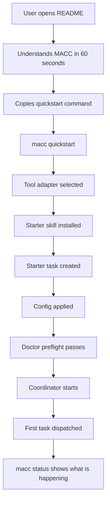
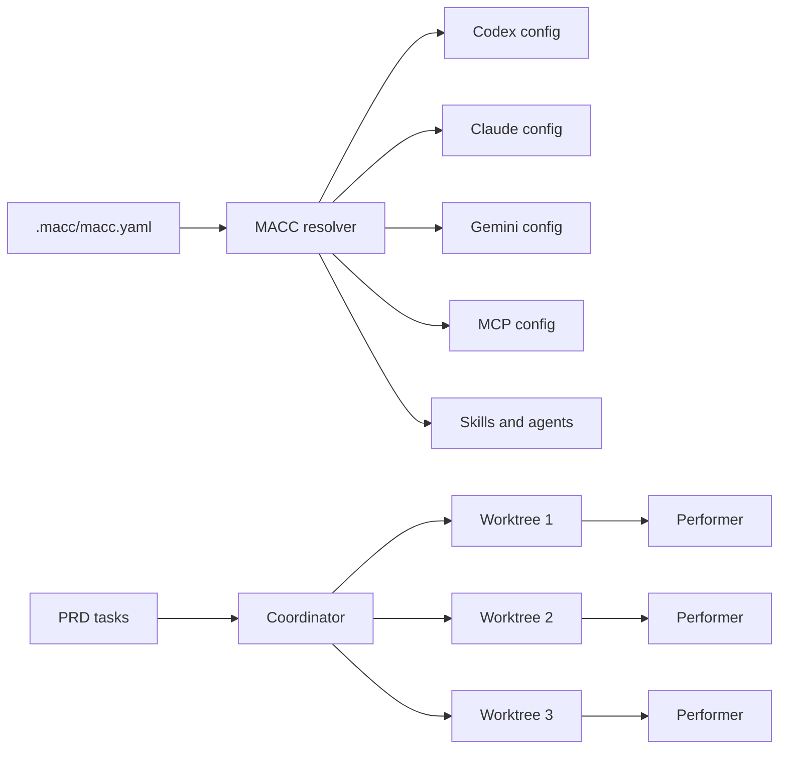

# MACC Usability, Onboarding, and README Improvement Plan

> **Document type:** Product + UX + engineering specification  
> **Project:** MACC — Multi-Assistant Code Config  
> **Scope:** First-run UX, `macc doctor`, `macc quickstart`, `macc status`, error design, README redesign, and documentation-as-onboarding  
> **Language:** English  
> **Status:** Proposed implementation plan

---

## 1. Executive summary

MACC already has a strong technical foundation: a canonical configuration model, tool adapters, TUI, local Web UI, coordinator, performer automation, worktree orchestration, remote skills/MCP distribution, backups, diagnostics, and operational logs. The main usability gap is that the user has to understand too many concepts before experiencing the first successful task.

This document proposes a unified onboarding and documentation motif:

> **From zero to first running task with one guided command, then make system state obvious at all times.**

The improvement plan is built around four product anchors:

| Anchor | Purpose | Primary command or surface |
|---|---|---|
| **Quickstart** | Get the user from a fresh repo to one running task | `macc quickstart` |
| **Doctor** | Tell the user what is broken and how to fix it | `macc doctor` |
| **Status** | Tell the user what is happening right now | `macc status` |
| **README** | Act as the first onboarding UI before the CLI/TUI/Web UI | `README.md` |

The README should not be treated as a static manual. It should become the first user experience: visual, scannable, interactive through Markdown affordances, and directly aligned with the first-run CLI path.

---

## 2. Current UX problem

### 2.1 Current first-run friction

A new user can run:

```bash
macc init
```

But then the path becomes unclear:

```text
What should I do next?
Do I need to select an adapter?
Do I need to run apply?
Where do tasks come from?
How do I start the coordinator?
What does the performer need?
Why did nothing happen?
Where are the logs?
```

MACC has many strong primitives, but first-time users need a **guided path** rather than a list of primitives.

### 2.2 Main usability risks

| Risk | User impact | Product impact |
|---|---|---|
| Opaque first run | User stops before seeing value | Poor activation |
| Missing Git identity | Commits fail silently or block progress | “No progress” deadlock class |
| Coordinator absent | Performer refuses to run | Confusing runtime failure |
| No ready task | Coordinator appears idle | User thinks MACC is broken |
| Hidden system state | User cannot tell what is running | Loss of trust |
| Giant README/spec | New user cannot find the happy path | Documentation fatigue |

---

## 3. Target UX model

### 3.1 New user mental model

MACC should teach this model:

```text
macc quickstart = get me started
macc doctor     = tell me what is broken
macc status     = tell me what is happening
macc web        = show me the dashboard
```

### 3.2 Desired first-run journey



### 3.3 UX principle

Every onboarding surface should answer the next question before the user asks it:

| User question | MACC answer |
|---|---|
| “What is this?” | README hero + visual overview |
| “How do I try it?” | `macc quickstart` |
| “What broke?” | `macc doctor` |
| “What is happening?” | `macc status` |
| “Where do I go deeper?” | Linked docs and collapsible README sections |
| “Can I trust what it writes?” | plan/apply preview, backups, consent gates |

---

## 4. Motif: Progressive Onboarding and Operational Legibility

### 4.1 Definition

**Progressive Onboarding** means MACC introduces concepts only when the user needs them.

**Operational Legibility** means MACC always exposes its current state in plain language.

Together:

```text
Users should never need to understand the full coordinator/worktree/adapter architecture before completing one useful run.
Users should never need to inspect raw logs to answer “is MACC doing anything?”
```

### 4.2 Product pillars

| Pillar | Description |
|---|---|
| **Guided activation** | `macc quickstart` scripts the happy path. |
| **Preflight diagnostics** | `macc doctor` validates the environment before work starts. |
| **Runtime visibility** | `macc status` gives a single state summary. |
| **Actionable errors** | Every failure says what happened, why, and what to do next. |
| **README as onboarding UI** | The README becomes the first product screen. |
| **TUI/Web parity** | CLI onboarding state also appears in TUI and Web UI. |

---

## 5. `macc doctor` improvements

`macc doctor` should evolve from a tool checker into a **readiness and repair system**.

### 5.1 New responsibility

Doctor should answer:

```text
Can MACC run a task right now?
If not, what is blocking it?
What can MACC fix safely?
What must the user fix manually?
```

### 5.2 Diagnostic groups

```text
macc doctor

Project
  ✅ Git repository detected
  ✅ .macc/macc.yaml exists
  ✅ PRD file found: prd.json
  ⚠️ No ready task found

Git
  ❌ Git identity missing
     user.name and/or user.email are not configured.
     Fix:
       git config --global user.name "Your Name"
       git config --global user.email "you@example.com"

Worktrees
  ✅ Git worktree support available
  ✅ Worktree root writable: .macc/worktree/
  ⚠️ Low available disk space: 1.2 GB
     Recommended: at least 5 GB for current max_parallel setting

Coordinator
  ❌ No coordinator IPC socket is available
     Start:
       macc coordinator run

Tools
  ✅ codex adapter installed
  ⚠️ gemini installed but not logged in
  ❌ claude configured but binary not found

Readiness
  ❌ Not ready to dispatch a task
     Blocking issues:
       1. Git identity missing
       2. No ready task found
       3. No coordinator is running
```

### 5.3 Required checks

#### 5.3.1 Git identity check

Purpose: prevent commit failures and “no progress” coordinator states.

Check order:

```bash
git config user.name
git config user.email
git config --global user.name
git config --global user.email
```

Severity rules:

| Condition | Severity |
|---|---|
| Local identity exists | OK |
| Only global identity exists | OK or warning, depending on strict mode |
| No identity exists | Error |
| Identity invalid format | Warning or error |

Auto-fix behavior:

```bash
macc doctor --fix --git-name "Alice Example" --git-email "alice@example.com"
```

Rules:

- Do not invent identity values.
- Do not write global Git config unless user explicitly requests it.
- Prefer local repo-level fix by default for project onboarding.
- Show the exact command that will be executed.

#### 5.3.2 Disk space check for worktrees

Coordinator parallelism can create multiple worktrees. Doctor should estimate the required capacity.

Suggested formula:

```text
recommended_free_space = max(repo_size * max_parallel * 1.25, 2 GB)
```

Example output:

```text
Worktree capacity
  Repository size: 820 MB
  max_parallel: 4
  Recommended free space: 4.1 GB
  Available: 2.3 GB
  Result: warning
```

Severity rules:

| Available space | Severity |
|---|---|
| >= recommended | OK |
| 50–100% of recommended | Warning |
| < 50% of recommended | Error |

#### 5.3.3 Coordinator IPC bind/connect check

Doctor should validate both sides of the runtime channel:

1. Can the coordinator bind its IPC socket?
2. Can a performer discover the coordinator address?
3. Can a performer connect to the coordinator?
4. Is the existing socket stale?

Potential findings:

```text
❌ IPC socket directory is not writable.
❌ Existing socket appears stale.
❌ Coordinator address file exists but target is unreachable.
❌ IPC socket path is too long for this OS.
✅ IPC socket bind test passed.
✅ Coordinator is reachable.
```

Safe fixes:

- Recreate missing state directory.
- Remove stale socket file.
- Rewrite coordinator address file when safe.
- Never kill a process without explicit confirmation.

#### 5.3.4 Task readiness check

Doctor should inspect whether a task can be dispatched now.

Check:

- PRD exists.
- Registry exists or can be initialized.
- At least one task is `todo` or `ready`.
- Dependencies do not block every task.
- At least one enabled tool can run.
- Worktree creation is possible.
- Coordinator can start or is already running.

Example:

```text
Task readiness
  ❌ No ready task found

Fix options:
  Create a starter task:
    macc quickstart --starter-task

  Or sync the registry from the PRD:
    macc coordinator sync-prd
```

#### 5.3.5 Tool login and capability check

A tool can be installed but not usable.

Doctor should distinguish:

| State | Meaning |
|---|---|
| installed | Binary exists |
| configured | MACC adapter config exists |
| authenticated | Tool has usable credentials/session |
| runnable | A dry-run or version check succeeds |
| capability-matched | Tool supports required task type |

Output:

```text
Tools
  codex
    ✅ binary found
    ✅ adapter enabled
    ✅ authentication check passed
    ✅ performer runner available

  gemini
    ✅ binary found
    ✅ adapter enabled
    ⚠️ authentication not confirmed
       Run the tool login flow, then retry macc doctor.
```

### 5.4 JSON output

```bash
macc doctor --json
```

Example:

```json
{
  "ready": false,
  "findings": [
    {
      "id": "MACC-GIT-IDENTITY-MISSING",
      "severity": "error",
      "category": "git",
      "title": "Git identity is missing",
      "message": "user.name and user.email are not configured.",
      "recommended_action": "Configure Git identity or run macc doctor --fix with --git-name and --git-email.",
      "fix_available": true
    }
  ]
}
```

### 5.5 Acceptance criteria

- Detect missing Git identity.
- Detect insufficient disk space for configured `max_parallel`.
- Detect unavailable, unreachable, or stale coordinator IPC.
- Detect whether at least one task can be dispatched.
- Detect adapter installed/configured/authenticated/runnable states.
- Support `--json`.
- Support safe `--fix`.
- Never perform destructive fixes without explicit confirmation.

---

## 6. `macc quickstart`

`macc quickstart` should be the primary activation command.

### 6.1 Goal

Take the user from:

```text
I installed MACC and I am inside a Git repository.
```

to:

```text
A coordinator is running and one starter task has been dispatched.
```

### 6.2 Interactive flow

```text
$ macc quickstart

Welcome to MACC.

Project detected:
  Path: /Users/alice/project
  Branch: main

No MACC config found.
Create .macc/macc.yaml? Yes

Detected tools:
  1. Codex       ✅ installed
  2. Claude      ❌ not found
  3. Gemini      ⚠️ installed, login not confirmed

Choose adapter [1]: 1

Starter skills:
  ✅ /validate-quick
  ✅ /implement
  ✅ /next-task

No PRD found.
Create a starter task? Yes

Task:
  QS-001 - Verify MACC setup

Running preflight...
  ❌ Git identity missing

Enter git user.name: Alice Example
Enter git user.email: alice@example.com

Applying config...
  ✅ Plan generated
  ✅ Files written
  ✅ Backups created

Start coordinator now? Yes

Coordinator running.
First task dispatched.

Next:
  macc status
  macc web
```

### 6.3 Non-interactive mode

```bash
macc quickstart \
  --tool codex \
  --starter-task \
  --apply \
  --start-coordinator
```

For validation only:

```bash
macc quickstart --check-only --json
```

For demos:

```bash
macc quickstart --demo --tool codex
```

### 6.4 Quickstart steps

| Step | Action | Failure handling |
|---|---|---|
| 1 | Detect project | If not Git repo, offer `git init` or stop |
| 2 | Initialize MACC | Create `.macc/` and baseline config |
| 3 | Select tool adapter | Recommend first runnable tool |
| 4 | Install starter skills | Add `/validate-quick`, `/implement`, `/next-task` |
| 5 | Create starter PRD/task | Only if no PRD/tasks exist |
| 6 | Run plan/apply | Show summary before writing |
| 7 | Run doctor | Apply safe fixes only |
| 8 | Start coordinator | Foreground or detached mode |
| 9 | Dispatch first task | Confirm first work item is active |
| 10 | Show status | End with `macc status` summary |

### 6.5 Starter task

If no PRD exists, quickstart may create:

```json
{
  "id": "QS-001",
  "title": "Verify MACC setup",
  "state": "todo",
  "description": "Run a minimal validation task to confirm that MACC, the selected tool adapter, worktrees, and coordinator execution are working.",
  "steps": [
    "Read the generated MACC configuration.",
    "Run a lightweight validation command.",
    "Write a short setup confirmation note.",
    "Commit the result using the MACC commit convention."
  ]
}
```

### 6.6 Teaching mode

Quickstart should reveal the equivalent commands:

```text
Equivalent commands:
  macc init
  macc add skill /validate-quick --tool codex
  macc add skill /implement --tool codex
  macc add skill /next-task --tool codex
  macc apply
  macc doctor
  macc coordinator run
  macc status
```

This teaches MACC progressively and avoids the feeling of a black box.

### 6.7 Acceptance criteria

- Works in a clean Git repository.
- Works in a repo that already has `.macc/`.
- Detects installed tool adapters.
- Recommends a runnable adapter.
- Creates starter task only when needed.
- Runs `macc apply` with backup/consent behavior.
- Runs `macc doctor` before coordinator startup.
- Starts coordinator when requested.
- Ends with `macc status`.
- Supports `--json` and non-interactive flags.

---

## 7. Better error design

### 7.1 Problem

Current runtime errors can be technically accurate but not actionable.

Example bad error:

```text
Performer run refused: no coordinator IPC address
```

This tells the user what the program failed to find, but not what to do.

### 7.2 Target error format

Every user-facing error should answer:

1. What happened?
2. Why did it happen?
3. What should I do next?
4. Where can I inspect more details?

### 7.3 Improved coordinator-absent error

```text
No MACC coordinator is running.

The performer needs a coordinator IPC address, but none was found.

Start a coordinator:
  macc coordinator run

Then retry:
  macc worktree run <id>

Inspect:
  macc status
  macc doctor --coordinator

Details:
  Missing coordinator address file:
  .macc/state/coordinator-address.json

Error code:
  MACC-COORDINATOR-IPC-MISSING
```

### 7.4 Structured error envelope

```json
{
  "error": {
    "code": "MACC-COORDINATOR-IPC-MISSING",
    "category": "coordinator",
    "message": "No MACC coordinator is running.",
    "why": "The performer needs a coordinator IPC address, but none was found.",
    "recommended_action": "Start one with `macc coordinator run` and try again.",
    "retryable": true,
    "inspect": [
      "macc status",
      "macc doctor --coordinator"
    ]
  }
}
```

### 7.5 Error copy guidelines

| Do | Avoid |
|---|---|
| “No coordinator is running.” | “IPC address missing.” |
| “Start one with `macc coordinator run`.” | “Connection refused.” |
| “No ready task found in `prd.json`.” | “Registry empty.” |
| “Git identity is missing.” | “git commit failed: exit 128.” |
| “Tool is installed but login is not confirmed.” | “Runner unavailable.” |

### 7.6 Minimum actionable error catalog

| Error code | Message | Recommended action |
|---|---|---|
| `MACC-GIT-IDENTITY-MISSING` | Git identity is missing. | Configure `user.name` and `user.email`. |
| `MACC-COORDINATOR-IPC-MISSING` | No coordinator is running. | Run `macc coordinator run`. |
| `MACC-COORDINATOR-IPC-STALE` | Coordinator socket appears stale. | Run `macc doctor --fix --coordinator`. |
| `MACC-TASK-NONE-READY` | No ready task found. | Create a task or run `macc coordinator sync-prd`. |
| `MACC-TOOL-NOT-RUNNABLE` | Selected tool cannot run. | Run tool login/setup, then `macc doctor`. |
| `MACC-WORKTREE-DISK-LOW` | Not enough disk space for worktrees. | Free disk space or reduce `max_parallel`. |
| `MACC-CONFIG-NOT-APPLIED` | Config has not been applied. | Run `macc apply`. |

---

## 8. New top-level `macc status`

### 8.1 Purpose

`macc status` should be the universal answer to:

```text
What is happening right now?
```

It should work even if the coordinator is absent.

### 8.2 Commands

```bash
macc status
macc status --json
macc status --watch
macc status --events 10
macc status --verbose
```

### 8.3 Human output

```text
MACC Status
Project: /Users/alice/project
Branch: main
Config: .macc/macc.yaml

Coordinator
  State: running
  PID: 84231
  IPC: .macc/state/coordinator.sock
  Uptime: 14m 22s
  Mode: full-cycle

Tasks
  todo:               8
  ready:              2
  in_progress:        1
  changes_requested:  0
  pr_open:            1
  merged:             4
  failed:             0
  blocked:            1

Workers
  active: 2 / 4
  codex: 1 running
  gemini: 1 throttled
  claude: unavailable

Worktrees
  total: 4
  active: 2
  reusable: 1
  dirty: 1

Health
  ✅ Git identity configured
  ✅ Worktree disk space OK
  ✅ IPC reachable
  ⚠️ 1 dirty reusable worktree
  ⚠️ gemini rate-limited for 4m 12s

Recent events
  14:02:11  TASK-004 dispatched to codex
  14:02:29  TASK-004 heartbeat
  14:03:02  TASK-003 merged
  14:03:08  worktree slot reused
  14:03:31  gemini rate-limited
```

### 8.4 Degraded output when coordinator is absent

```text
MACC Status
Project: /Users/alice/project
Branch: main
Config: .macc/macc.yaml

Coordinator
  State: not running

Next action:
  macc coordinator run

Readiness
  ⚠️ Config exists but no coordinator is active
  ✅ Git identity configured
  ✅ 2 ready tasks found
  ✅ codex adapter runnable

Recent events
  No recent coordinator events found.
```

### 8.5 JSON output

```json
{
  "project": {
    "path": "/Users/alice/project",
    "branch": "main",
    "config_path": ".macc/macc.yaml"
  },
  "coordinator": {
    "state": "running",
    "pid": 84231,
    "ipc_reachable": true,
    "uptime_seconds": 862,
    "mode": "full-cycle"
  },
  "tasks": {
    "todo": 8,
    "ready": 2,
    "in_progress": 1,
    "changes_requested": 0,
    "pr_open": 1,
    "merged": 4,
    "failed": 0,
    "blocked": 1
  },
  "workers": {
    "active": 2,
    "max_parallel": 4,
    "by_tool": {
      "codex": { "running": 1 },
      "gemini": { "throttled": 1 },
      "claude": { "unavailable": 1 }
    }
  },
  "health": [
    {
      "id": "MACC-GIT-IDENTITY",
      "severity": "ok",
      "title": "Git identity configured"
    }
  ],
  "recent_events": []
}
```

### 8.6 Relationship to existing commands

Keep lower-level commands:

```bash
macc coordinator status
macc worktree status
macc doctor
```

But make `macc status` the user-facing overview:

```text
macc status
  ├─ project summary
  ├─ coordinator state
  ├─ task counts
  ├─ worker state
  ├─ worktree summary
  ├─ throttled tools
  ├─ lightweight health checks
  └─ recent events
```

### 8.7 Acceptance criteria

- Shows coordinator state.
- Shows task counts by state.
- Shows active worker count.
- Shows throttled tools and countdowns.
- Shows worktree summary.
- Shows last N events.
- Works when coordinator is absent.
- Supports `--watch`.
- Supports `--json`.
- Reuses the same data model as Web `/api/v1/status`.

---

## 9. Readiness ladder

### 9.1 Purpose

The readiness ladder makes onboarding state visible and motivating.

```text
MACC readiness

1. Project initialized        ✅
2. Tool adapter selected      ✅ codex
3. Config applied             ✅
4. PRD/task available         ✅ QS-001
5. Git identity configured    ❌
6. Coordinator running        ❌
7. Performer connected        —
8. First task dispatched      —
```

### 9.2 Where it appears

| Surface | Usage |
|---|---|
| `macc quickstart` | Main progress UI |
| `macc doctor` | Readiness summary |
| `macc status` | Compact health block |
| TUI Welcome screen | Onboarding checklist |
| Web `/welcome` | First-run cards |
| Web `/dashboard` | Ongoing status |
| Web `/ops/diagnostics` | Detailed issue cards |

### 9.3 State storage

Prefer runtime state over canonical config:

```text
.macc/state/onboarding.json
```

Example:

```json
{
  "quickstart_version": 1,
  "completed_steps": {
    "init": true,
    "tool_selected": true,
    "starter_skill_installed": true,
    "starter_task_created": false,
    "config_applied": true,
    "doctor_passed": false,
    "coordinator_started": false,
    "first_task_dispatched": false
  },
  "last_error": {
    "code": "MACC-GIT-IDENTITY-MISSING",
    "message": "Git identity is missing"
  }
}
```

Reason: onboarding progress is local runtime state, not project source-of-truth configuration.

---

## 10. README redesign: Documentation as Onboarding UI

### 10.1 Core idea

The README should become the first MACC user interface.

Before a user runs `macc quickstart`, the README should already make MACC feel understandable, safe, and worth trying.

### 10.2 README goals

A new visitor should be able to answer these questions in under 60 seconds:

```text
What is MACC?
Why does it exist?
How do I try it?
What will it write?
How do I see what is happening?
Where do I go deeper?
```

### 10.3 README design principles

| Principle | Application |
|---|---|
| **Show, then explain** | Start with hero image/GIF and quickstart. |
| **Progressive disclosure** | Use collapsible sections for advanced details. |
| **One primary path** | Promote `macc quickstart`, not every command. |
| **Trust through transparency** | Show generated files, backups, consent gates. |
| **Operational clarity** | Highlight `macc status` and `macc doctor`. |
| **Visual hierarchy** | Use screenshots, diagrams, tables, and concise copy. |

### 10.4 Proposed README information architecture

```md
# MACC
One sentence value proposition.

[Badges]

## Visual overview
Hero image or animated terminal demo.

## 30-second quickstart
Install, initialize, quickstart, status.

## Why MACC?
Problem → solution → benefits.

## Core workflows
Configure tools, apply config, run coordinator, monitor status.

## Demo: from init to first task
Terminal GIF or asciinema link.

## Architecture
Simplified Mermaid diagram.

## CLI map
Most important commands only.

## Screenshots
TUI, Web dashboard, coordinator status, diagnostics.

## Troubleshooting
Top first-run problems.

## Documentation
Links to deeper docs.
```

### 10.5 Recommended visual assets

Create:

```text
docs/assets/
  hero.png
  quickstart-demo.gif
  tui-tools.png
  tui-coordinator-live.png
  web-dashboard.png
  web-diagnostics.png
  web-git-graph.png
  macc-architecture.svg
  onboarding-ladder.svg
```

Recommended visuals:

| Asset | Purpose |
|---|---|
| `hero.png` | One config → many tools → coordinated worktrees |
| `quickstart-demo.gif` | Shows `macc quickstart` and `macc status` |
| `tui-tools.png` | Demonstrates adapter selection |
| `tui-coordinator-live.png` | Shows live worker/coordinator state |
| `web-dashboard.png` | Shows Web UI value |
| `web-diagnostics.png` | Shows doctor/readiness cards |
| `web-git-graph.png` | Shows operational observability |
| `onboarding-ladder.svg` | Shows first-run progress model |

### 10.6 README UI/UX style direction

| Dimension | Recommendation |
|---|---|
| Tone | Clear, operational, confident |
| Visual style | Terminal-first, dashboard-like, minimal |
| Screenshot theme | Dark mode, high contrast, readable text |
| Accent colors | Green for ready, amber for warning, red for blocked, blue for info |
| Copy style | Short sections, command-first, plain language |
| Interaction | Collapsible details, Mermaid diagrams, copyable command blocks |

### 10.7 README should not become the full spec

The README should link to deeper docs:

```md
## Documentation

| Topic | Doc |
|---|---|
| Installation | `docs/INSTALL.md` |
| Init and apply | `docs/INIT_APPLY.md` |
| Tool onboarding | `docs/TOOL_ONBOARDING.md` |
| Worktrees | `docs/WORKTREES.md` |
| Coordinator | `docs/COORDINATOR.md` |
| Web API | `docs/WEB_API_CONTRACT.md` |
| Errors | `docs/ERRORS.md` |
| Security | `SECURITY.md` |
```

---

## 11. Proposed README template

The following is a ready-to-adapt README structure.

```md
# MACC

> **Multi-Assistant Code Config** — a local configuration and orchestration layer for AI coding tools.

MACC helps you keep a consistent AI coding setup across projects and machines, generate tool-specific configuration from one canonical source of truth, and coordinate parallel AI coding work through worktrees.

<p align="center">
  
</p>

<p align="center">
  <a href="#30-second-quickstart">Quickstart</a> ·
  <a href="#why-macc">Why MACC?</a> ·
  <a href="#core-workflows">Workflows</a> ·
  <a href="#screenshots">Screenshots</a> ·
  <a href="#troubleshooting">Troubleshooting</a> ·
  <a href="#documentation">Docs</a>
</p>

---

## 30-second quickstart

```bash
# In your project repository
macc quickstart

# Then inspect what is happening
macc status
```

`macc quickstart` guides you through:

1. initializing `.macc/`,
2. selecting a tool adapter,
3. installing starter skills,
4. creating or selecting a first task,
5. applying generated config,
6. running diagnostics,
7. starting the coordinator.

```bash
# Open the local Web UI
macc web
```

---

## Why MACC?

AI coding assistants each use different configuration files, instruction formats, skills, agents, MCP settings, and permission models.

MACC gives you:

| Without MACC | With MACC |
|---|---|
| Duplicated tool configs | One canonical config |
| Different setup per machine | Reproducible project setup |
| Manual worktree orchestration | Coordinator-driven parallelism |
| Opaque failures | `macc doctor` and `macc status` |
| Hard-to-share conventions | Versioned standards and skills |

---

## Visual overview



---

## Core workflows

| I want to... | Run this |
|---|---|
| Start from scratch | `macc quickstart` |
| Initialize manually | `macc init` |
| Preview generated changes | `macc plan` |
| Apply tool configs | `macc apply` |
| Check what is broken | `macc doctor` |
| See what is happening | `macc status` |
| Open the TUI | `macc` |
| Open the Web UI | `macc web` |
| Run the coordinator | `macc coordinator run` |
| Create worktrees | `macc worktree create <slug> --tool <tool> --count 2` |

---

## First-run readiness

MACC makes setup visible with a readiness ladder:

```text
1. Project initialized        ✅
2. Tool adapter selected      ✅ codex
3. Config applied             ✅
4. PRD/task available         ✅ QS-001
5. Git identity configured    ✅
6. Coordinator running        ✅
7. Performer connected        ✅
8. First task dispatched      ✅
```

If something is blocked:

```bash
macc doctor
```

---

## Screenshots

### TUI tool selection


### Coordinator live view


### Web dashboard


### Diagnostics


---

## Troubleshooting

### No coordinator is running

```text
No MACC coordinator is running.
```

Fix:

```bash
macc coordinator run
```

Then inspect:

```bash
macc status
```

### Git identity is missing

```bash
git config --global user.name "Your Name"
git config --global user.email "you@example.com"
```

Or run:

```bash
macc doctor --fix --git-name "Your Name" --git-email "you@example.com"
```

### No ready task found

```bash
macc quickstart --starter-task
```

Or sync from the PRD:

```bash
macc coordinator sync-prd
```

<details>
<summary>Advanced coordinator recovery</summary>

```bash
macc coordinator status
macc coordinator sync-prd
macc coordinator reconcile
macc coordinator unlock
macc coordinator cleanup
macc coordinator run
```

</details>

---

## Documentation

| Topic | Doc |
|---|---|
| Installation | `docs/INSTALL.md` |
| Project initialization | `docs/INIT_APPLY.md` |
| Tool onboarding | `docs/TOOL_ONBOARDING.md` |
| Worktrees | `docs/WORKTREES.md` |
| Coordinator | `docs/COORDINATOR.md` |
| Web UI | `MACC_Web_Client_spec.md` |
| Web API | `docs/WEB_API_CONTRACT.md` |
| Error codes | `docs/ERRORS.md` |
| Security | `SECURITY.md` |

---

## Security model

MACC is local-first.

- No secrets are committed.
- Remote packages are data-only.
- User-level writes require backup and consent.
- Web UI binds to localhost by default.
- Mutating Web API requests are audit-logged.
```

---

## 12. README enhancement checklist

### 12.1 Content checklist

- [ ] One-sentence value proposition at the top.
- [ ] Hero image or overview diagram.
- [ ] 30-second quickstart before long explanation.
- [ ] `macc quickstart`, `macc doctor`, and `macc status` highlighted.
- [ ] “Choose your path” command table.
- [ ] Simplified architecture diagram.
- [ ] Screenshots for TUI and Web UI.
- [ ] Top first-run troubleshooting issues.
- [ ] Links to deeper docs.
- [ ] Security/trust summary.

### 12.2 UX checklist

- [ ] Above-the-fold section explains product and next action.
- [ ] No giant wall of text before quickstart.
- [ ] Advanced details hidden behind `<details>` sections.
- [ ] Commands are copyable.
- [ ] Diagrams are readable in dark and light GitHub themes.
- [ ] Screenshots are compressed and legible.
- [ ] All image alt text is meaningful.

### 12.3 Maintenance checklist

- [ ] README commands are tested in CI or docs validation.
- [ ] Screenshots are refreshed before release.
- [ ] Broken links are checked in CI.
- [ ] Mermaid diagrams render in GitHub.
- [ ] README does not duplicate deep docs unnecessarily.

---

## 13. TUI and Web onboarding parity

### 13.1 TUI welcome screen

The TUI should show:

```text
Welcome to MACC

Readiness
  ✅ Project initialized
  ✅ Tool adapter selected: codex
  ⚠️ Config not applied
  ❌ Coordinator not running

Primary actions
  [q] Quickstart
  [d] Doctor
  [a] Apply
  [r] Run coordinator
  [s] Status
```

### 13.2 Web Welcome page

The Web UI already has planned onboarding/dashboard surfaces. The first-run Web page should present cards:

| Card | Content |
|---|---|
| Project | repo path, branch, config state |
| Tools | selected adapter, login/runnable state |
| Tasks | PRD found, ready task count |
| Coordinator | running/not running, action button |
| Doctor | health score and blocking issues |

### 13.3 Web diagnostics page

The Web diagnostics page should reuse the same `DiagnosticFinding` model as CLI `macc doctor`.

Example issue card:

```text
Git identity is missing
Severity: Error
Why it matters: MACC performers need to create commits.
Fix: Configure user.name and user.email.
Action: Apply local Git identity fix
```

---

## 14. Shared implementation model

### 14.1 Proposed core modules

```text
core/src/doctor/
  mod.rs
  report.rs
  fix.rs
  checks/
    git_identity.rs
    disk_space.rs
    ipc.rs
    coordinator.rs
    task_readiness.rs
    worktree_capacity.rs
    tool_login.rs

core/src/status/
  mod.rs
  collector.rs
  render.rs
  types.rs

core/src/onboarding/
  mod.rs
  state.rs
  readiness.rs

cli/src/commands/
  quickstart.rs
  status.rs
```

### 14.2 Shared diagnostic type

```rust
pub enum DiagnosticSeverity {
    Ok,
    Info,
    Warning,
    Error,
}

pub struct DiagnosticFinding {
    pub id: String,
    pub title: String,
    pub severity: DiagnosticSeverity,
    pub category: String,
    pub message: String,
    pub recommended_action: Option<String>,
    pub fix_available: bool,
    pub docs_ref: Option<String>,
}
```

### 14.3 Shared status type

```rust
pub struct MaccStatus {
    pub project: ProjectStatus,
    pub coordinator: CoordinatorStatus,
    pub tasks: TaskCounts,
    pub workers: WorkerStatus,
    pub worktrees: WorktreeSummary,
    pub tools: ToolSummary,
    pub health: Vec<DiagnosticFinding>,
    pub recent_events: Vec<CoordinatorEvent>,
}
```

### 14.4 Benefits

| Benefit | Explanation |
|---|---|
| No duplicated logic | CLI, TUI, and Web reuse the same readiness model. |
| Consistent messages | The same issue gets the same wording everywhere. |
| Better testing | Doctor and status can be tested at the core layer. |
| Cleaner Web API | `/api/v1/status` and `/api/v1/doctor` return shared structs. |

---

## 15. Suggested roadmap

### Phase 1 — Actionable errors

Implement first because it is small and immediately improves UX.

Deliverables:

- Structured CLI error envelope.
- Improved coordinator-absent error.
- Improved no-ready-task error.
- Improved Git identity error.
- `recommended_action` field in relevant errors.

### Phase 2 — `macc status`

Deliverables:

- `core/src/status` collector.
- Human renderer.
- `--json` output.
- Degraded mode when coordinator is absent.
- Recent events summary.
- Lightweight health checks.

### Phase 3 — Doctor readiness checks

Deliverables:

- Git identity check.
- Disk/worktree capacity check.
- IPC bind/connect check.
- Task readiness check.
- Tool runnable/auth check.
- Safe `--fix` flow.

### Phase 4 — `macc quickstart`

Deliverables:

- Interactive happy path.
- Non-interactive flags.
- Starter skills.
- Starter task.
- Apply + doctor + coordinator startup.
- Final `macc status` display.

### Phase 5 — README redesign

Deliverables:

- New README information architecture.
- Hero diagram.
- Quickstart GIF.
- Screenshots.
- Troubleshooting section.
- Docs map.
- CI link validation.

### Phase 6 — TUI/Web onboarding parity

Deliverables:

- TUI welcome readiness screen.
- Web welcome cards.
- Web diagnostics issue cards.
- Shared `DiagnosticFinding` model across surfaces.

---

## 16. Release acceptance criteria

### 16.1 Activation

- [ ] A new user can run `macc quickstart` in a repo and reach a visible first task state.
- [ ] If quickstart cannot complete, it stops with an actionable error.
- [ ] Quickstart never silently ignores blocking problems.

### 16.2 Diagnostics

- [ ] `macc doctor` reports project, Git, worktree, coordinator, tool, and task readiness.
- [ ] `macc doctor --json` returns structured diagnostics.
- [ ] `macc doctor --fix` applies only safe fixes.

### 16.3 Status

- [ ] `macc status` works whether or not the coordinator is running.
- [ ] `macc status` shows task counts, workers, worktrees, tools, health, and recent events.
- [ ] `macc status --json` matches the Web status model.

### 16.4 Errors

- [ ] Coordinator-absent errors are rewritten.
- [ ] Git identity errors include exact fix commands.
- [ ] No-ready-task errors suggest starter task creation or PRD sync.
- [ ] All major runtime errors include a stable code and recommended action.

### 16.5 README

- [ ] README explains MACC in under 60 seconds.
- [ ] README includes a 30-second quickstart.
- [ ] README includes screenshots or visual placeholders.
- [ ] README includes a simplified architecture diagram.
- [ ] README includes first-run troubleshooting.
- [ ] README links to deeper docs instead of duplicating them.

---

## 17. Proposed GitHub issues

### Issue 1 — Add actionable coordinator-absent error

**Description:** Replace opaque performer IPC failure with a user-facing structured error.

**Acceptance criteria:**

- Error says no coordinator is running.
- Error recommends `macc coordinator run`.
- Error suggests `macc status` and `macc doctor --coordinator`.
- JSON output includes `MACC-COORDINATOR-IPC-MISSING`.

### Issue 2 — Implement top-level `macc status`

**Description:** Add a single command that summarizes project, coordinator, tasks, workers, worktrees, health, and recent events.

**Acceptance criteria:**

- Works without coordinator.
- Supports `--json`.
- Supports `--watch`.
- Shows recent events.
- Reuses Web `/api/v1/status` model where possible.

### Issue 3 — Extend `macc doctor` with readiness checks

**Description:** Add checks for Git identity, disk space, IPC, task readiness, and tool runnable state.

**Acceptance criteria:**

- Reports blocking readiness issues.
- Supports safe fixes.
- Supports JSON.
- Provides recommended actions.

### Issue 4 — Implement `macc quickstart`

**Description:** Add guided first-run flow from init to first running task.

**Acceptance criteria:**

- Detects project state.
- Selects tool adapter.
- Installs starter skills.
- Creates starter task if needed.
- Runs apply and doctor.
- Starts coordinator when requested.
- Ends with status summary.

### Issue 5 — Redesign README as onboarding UI

**Description:** Rewrite README as a visual, scannable, quickstart-first product front door.

**Acceptance criteria:**

- Adds hero section.
- Adds 30-second quickstart.
- Adds visual architecture diagram.
- Adds choose-your-path command table.
- Adds screenshots.
- Adds troubleshooting.
- Links to deeper docs.

### Issue 6 — Add README visual assets

**Description:** Add screenshot and diagram assets under `docs/assets/`.

**Acceptance criteria:**

- Hero image committed.
- Quickstart demo GIF committed.
- TUI screenshots committed.
- Web screenshots committed.
- Alt text added for all images.

---

## 18. Final recommendation

This should be treated as a coherent product initiative rather than separate small improvements.

Recommended name:

> **MACC Onboarding and Operational Legibility Initiative**

Core message:

```text
macc quickstart gets you started.
macc doctor tells you what is broken.
macc status tells you what is happening.
README shows the whole path before you run anything.
```

This initiative would make MACC feel dramatically more mature, safer, and easier to adopt. It also aligns the CLI, TUI, Web UI, and documentation around one consistent first-run experience.
