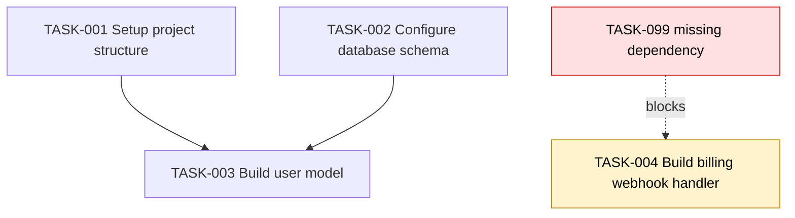

# MACC Coordinator Simulation — Detailed Feature Specification

**Project:** MACC  
**Feature:** PRD execution simulation / coordinator dry-run  
**Status:** Proposed refinement  
**Date:** 2026-05-25  
**Language:** English  

---

## 1. Executive summary

MACC should add a **read-only Coordinator Simulation mode** that loads the PRD, coordinator configuration, and optionally the task registry, then traverses the same task-selection logic used by the real coordinator without executing tasks.

The simulation must produce a clear report showing:

- which tasks would run in parallel,
- which tasks would run sequentially,
- which tasks are blocked,
- which dependencies or resource constraints create bottlenecks,
- where the coordinator would stop making progress,
- and which exact PRD entries or registry states are responsible.

This feature is intended to make MACC easier and safer to use before launching expensive or long-running autonomous AI coding work.

The critical design rule is:

> The simulator must reuse the real coordinator task-selection logic, but run it against a virtual, immutable execution state.

The simulator must never create worktrees, launch performers, call AI tools, modify the PRD, mutate the registry, create branches, acquire persistent locks, or write session state.

---

## 2. Correction applied from review

The simulator must **not** recommend that the user create a new task when a dependency is missing.

For example, if `TASK-014` depends on `TASK-099`, and `TASK-099` does not exist, the user-facing recommendation must not say:

```text
Create a new TASK-099.
```

Instead, the simulator should present corrective, non-generative actions:

```text
TASK-014 references missing dependency TASK-099.
Recommended actions:
1. Replace TASK-099 with an existing task ID if this is a typo.
2. Remove TASK-099 from TASK-014 dependencies if the dependency is obsolete.
3. Mark TASK-014 as blocked for manual PRD review if the intended predecessor is unclear.
```

Rationale:

- MACC should not prompt users to add arbitrary tasks as a diagnostic fix.
- The simulator should help users repair consistency errors, not expand the task graph automatically.
- A missing dependency is primarily a PRD integrity issue, not proof that a new task should exist.

This rule applies to all CLI, TUI, Web UI, JSON reports, diagnostics, and suggested fixes.

---

## 3. Problem statement

MACC already supports coordinator-driven automation based on PRD tasks, dependencies, priorities, exclusive resources, tools, and worktree parallelism. However, a user currently may only discover dependency mistakes or workflow bottlenecks after starting the real coordinator.

That is costly because a real run may:

- create worktrees,
- start AI tool sessions,
- consume provider quota,
- modify branches,
- produce partial commits,
- reach a stuck state only after several dispatch cycles,
- or require manual recovery.

The proposed simulation mode lets the user validate the PRD execution graph before running automation.

The feature answers questions such as:

- What will run first?
- Which tasks can run together?
- Which tasks are forced to run sequentially?
- Which task is on the critical path?
- Which task blocks the most downstream work?
- Which tasks can never run?
- Which dependencies are invalid?
- Which exclusive resources are over-constraining parallelism?
- Would increasing `max_parallel` actually help?
- Would the coordinator get stuck before all tasks are completed?

---

## 4. Goals

### 4.1 Product goals

1. Make PRD execution behavior understandable before running the coordinator.
2. Reduce user uncertainty around parallel and sequential task execution.
3. Identify blocking dependency problems before AI tools are launched.
4. Provide actionable diagnostics without mutating the task graph.
5. Support both CLI-first users and visual TUI/Web UI users.
6. Enable CI validation for PRD consistency.
7. Improve trust in MACC automation by showing exactly what the coordinator would do.

### 4.2 Technical goals

1. Reuse the coordinator's existing task-selection logic.
2. Keep simulation deterministic.
3. Keep simulation side-effect-free.
4. Expose a stable machine-readable `SimulationReport`.
5. Integrate with existing diagnostics and Web UI dependency graph surfaces.
6. Support registry-aware simulation for recovery and resume workflows.
7. Keep the feature compatible with future SQLite registry storage.

---

## 5. Non-goals

The simulation feature must not:

- execute tasks,
- create worktrees,
- start performer scripts,
- invoke any AI tool,
- create commits,
- merge branches,
- edit the PRD,
- create missing tasks,
- rewrite dependencies automatically,
- mutate task registry state,
- acquire persistent locks,
- fetch remote packages by default,
- or behave as a full CI/CD scheduler.

The simulator is a read-only explanation and validation layer, not a new execution engine.

---

## 6. Proposed command surface

### 6.1 Primary command

```bash
macc coordinator simulate
```

### 6.2 Accepted aliases

```bash
macc coordinator dry-run
macc prd simulate
```

The primary command should be documented first. Aliases can exist for discoverability.

---

## 7. Simulation modes

### 7.1 Static PRD simulation

```bash
macc coordinator simulate --prd prd.json
```

This mode reads only the PRD and coordinator configuration.

It answers:

> If all tasks start from `todo`, what would the ideal execution waves look like?

Use cases:

- initial PRD validation,
- planning before starting automation,
- reviewing parallelization potential,
- detecting missing dependencies and cycles.

### 7.2 Registry-aware simulation

```bash
macc coordinator simulate --from-registry
```

This mode reads the current task registry and simulates forward from the current known state.

It answers:

> Given the real current registry state, what can still run, what is already done, and what is blocked?

Use cases:

- before resuming a paused coordinator,
- after manual recovery,
- after `sync-prd`,
- after a failed or interrupted run,
- before `reconcile` or `cleanup`.

### 7.3 What-if simulation

```bash
macc coordinator simulate --max-parallel 8
macc coordinator simulate --tool-priority codex,claude,gemini
macc coordinator simulate --ignore-exclusive-resources
macc coordinator simulate --assume-task-merged TASK-012
```

This mode overlays temporary assumptions on top of the PRD/config/registry.

It answers:

> Would changing coordinator settings or task assumptions reduce the number of waves or unblock the plan?

What-if options must be clearly marked as temporary and must never be persisted unless the user later edits configuration explicitly through existing config flows.

---

## 8. Recommended CLI options

```bash
macc coordinator simulate \
  --prd <path> \
  --from-registry \
  --json \
  --graph mermaid|dot|json \
  --max-parallel <n> \
  --max-dispatch <n> \
  --tool-priority <comma-separated-tools> \
  --show-blocked \
  --show-critical-path \
  --show-resource-contention \
  --fail-on-stuck \
  --fail-on-cycle \
  --fail-on-missing-dependency \
  --ignore-exclusive-resources \
  --assume-task-merged <TASK-ID> \
  --assume-task-skipped <TASK-ID>
```

### 8.1 CI-oriented examples

Fail if the PRD cannot converge:

```bash
macc coordinator simulate --fail-on-stuck
```

Fail if dependency cycles exist:

```bash
macc coordinator simulate --fail-on-cycle
```

Fail on any dependency integrity issue:

```bash
macc coordinator simulate \
  --fail-on-cycle \
  --fail-on-missing-dependency \
  --fail-on-stuck
```

Generate JSON for another tool:

```bash
macc coordinator simulate --json > .macc/reports/simulation.json
```

Generate a Mermaid graph:

```bash
macc coordinator simulate --graph mermaid > .macc/reports/simulation.mmd
```

---

## 9. Expected CLI output

### 9.1 Human-readable output

```text
MACC Coordinator Simulation

Mode: static PRD simulation
PRD: prd.json
Tasks: 42 total
Coordinator max_parallel: 4
Coordinator max_dispatch: 4
Registry used: no
Side effects: disabled

Execution waves:

Wave 1 — 4 parallel tasks
  TASK-001  Setup project structure
  TASK-002  Configure database schema
  TASK-003  Create design tokens
  TASK-004  Add authentication scaffold

Wave 2 — 3 parallel tasks
  TASK-005  Build user model
    unblocked by: TASK-002
  TASK-006  Build auth UI
    unblocked by: TASK-003, TASK-004
  TASK-007  Add route guards
    unblocked by: TASK-004

Wave 3 — 1 task
  TASK-008  End-to-end login flow
    unblocked by: TASK-005, TASK-006, TASK-007

Bottlenecks:

High severity
  TASK-014 cannot run.
  Reason: dependency TASK-099 does not exist.
  Location: tasks[13].dependencies[1]
  Recommended actions:
    - Replace TASK-099 with an existing task ID if this is a typo.
    - Remove TASK-099 from TASK-014 dependencies if obsolete.
    - Mark TASK-014 as blocked for manual PRD review if the intended predecessor is unclear.

Medium severity
  TASK-021 is on the critical path.
  Reason: 9 downstream tasks depend on it.
  Recommended actions:
    - Review whether TASK-021 can be split into smaller independent subtasks during PRD authoring.
    - Move independent downstream work out from behind TASK-021 if dependency is unnecessary.

Medium severity
  exclusive_resource "pnpm-lock.yaml" serializes 6 tasks.
  Affected tasks: TASK-010, TASK-011, TASK-012, TASK-013, TASK-018, TASK-019
  Recommended actions:
    - Group lockfile-changing tasks into an intentional dependency chain.
    - Remove the exclusive resource from tasks that do not actually modify it.

Summary:
  Estimated waves: 11
  Max theoretical parallelism: 6
  Effective parallelism with current settings: 3.2
  Critical path length: 8 tasks
  Unreachable tasks: 1
  Stuck: yes
```

### 9.2 Rules for recommendations

Recommendations must be diagnostic and corrective.

They may suggest:

- replacing an invalid dependency with an existing task ID,
- removing an obsolete dependency,
- reviewing a task manually,
- marking a task blocked,
- adjusting priority,
- changing `max_parallel`,
- removing unnecessary exclusive resources,
- reordering dependencies,
- running `sync-prd`,
- running `reconcile`,
- checking stale registry state,
- enabling a required tool,
- or changing tool priority.

They must not suggest:

- creating a new task as a direct diagnostic fix,
- auto-generating missing tasks,
- editing the PRD without explicit user action,
- launching the real coordinator,
- or invoking an AI tool to repair the PRD by default.

---

## 10. Simulation report model

The simulator should expose a stable data model so that CLI, TUI, Web UI, diagnostics, and CI can share the same output.

### 10.1 Top-level type

```rust
pub struct SimulationReport {
    pub schema_version: String,
    pub generated_at: DateTime<Utc>,
    pub project_root: PathBuf,
    pub prd_path: PathBuf,
    pub mode: SimulationMode,
    pub side_effects: SideEffectPolicy,
    pub config_snapshot: SimulationConfigSnapshot,
    pub task_count: TaskCount,
    pub waves: Vec<SimulationWave>,
    pub blocked_tasks: Vec<BlockedTask>,
    pub unreachable_tasks: Vec<TaskId>,
    pub critical_path: Vec<TaskId>,
    pub bottlenecks: Vec<SimulationBottleneck>,
    pub stuck_points: Vec<StuckPoint>,
    pub metrics: SimulationMetrics,
    pub exit_assessment: SimulationExitAssessment,
}
```

### 10.2 Simulation mode

```rust
pub enum SimulationMode {
    StaticPrd,
    RegistryAware,
    WhatIf,
}
```

### 10.3 Side-effect policy

```rust
pub struct SideEffectPolicy {
    pub creates_worktrees: bool,
    pub launches_tools: bool,
    pub writes_registry: bool,
    pub writes_prd: bool,
    pub modifies_git: bool,
    pub performs_network_io: bool,
}
```

For normal simulation, all fields must be `false`.

### 10.4 Simulation wave

```rust
pub struct SimulationWave {
    pub index: usize,
    pub selected_tasks: Vec<SimulatedTaskRun>,
    pub ready_but_not_selected: Vec<TaskId>,
    pub blocked_tasks_snapshot: Vec<BlockedTask>,
    pub occupied_resources: Vec<String>,
    pub limiting_factor: Option<WaveLimitingFactor>,
}
```

### 10.5 Simulated task run

```rust
pub struct SimulatedTaskRun {
    pub task_id: TaskId,
    pub title: String,
    pub selected_tool: Option<String>,
    pub priority: Option<i64>,
    pub dependencies_satisfied_by: Vec<TaskId>,
    pub exclusive_resources: Vec<String>,
    pub virtual_start_wave: usize,
    pub virtual_finish_wave: usize,
}
```

### 10.6 Blocked task

```rust
pub struct BlockedTask {
    pub task_id: TaskId,
    pub title: String,
    pub reasons: Vec<BlockReason>,
    pub missing_dependencies: Vec<TaskId>,
    pub waiting_for: Vec<TaskId>,
    pub blocking_registry_states: Vec<TaskState>,
    pub source_location: Option<PrdSourceLocation>,
}
```

### 10.7 Block reason

```rust
pub enum BlockReason {
    WaitingForDependencies,
    MissingDependency,
    CircularDependency,
    DependencyInTerminalNonSuccessState,
    ExclusiveResourceUnavailable,
    RequiredToolUnavailable,
    ToolThrottled,
    StaleInProgressDependency,
    InvalidTaskState,
    DelayedUntilFuture,
}
```

### 10.8 Bottleneck

```rust
pub struct SimulationBottleneck {
    pub severity: Severity,
    pub kind: BottleneckKind,
    pub task_id: Option<TaskId>,
    pub message: String,
    pub affected_tasks: Vec<TaskId>,
    pub source_location: Option<PrdSourceLocation>,
    pub recommended_actions: Vec<RecommendedAction>,
}
```

### 10.9 Bottleneck kind

```rust
pub enum BottleneckKind {
    MissingDependency,
    CircularDependency,
    ExclusiveResourceContention,
    MaxParallelLimit,
    ToolUnavailable,
    ToolSpecializationMismatch,
    PriorityInversion,
    StaleRegistryState,
    DelayedTask,
    InvalidStateTransition,
    DuplicateTaskId,
    UnreachableTask,
    CriticalPathConcentration,
    RegistryPrdMismatch,
}
```

### 10.10 Recommended action

```rust
pub struct RecommendedAction {
    pub action_type: RecommendedActionType,
    pub label: String,
    pub explanation: String,
    pub safe_to_auto_apply: bool,
}
```

```rust
pub enum RecommendedActionType {
    ReplaceDependencyWithExistingTask,
    RemoveObsoleteDependency,
    MarkTaskBlockedForReview,
    ReviewDependencyCycle,
    RemoveUnnecessaryExclusiveResource,
    AdjustCoordinatorParallelism,
    AdjustTaskPriority,
    EnableRequiredTool,
    RunSyncPrd,
    RunReconcile,
    RunDoctor,
    InspectRegistryState,
}
```

The enum deliberately does **not** include `CreateTask`.

---

## 11. Core algorithm

### 11.1 High-level loop

```text
load config
load PRD
load registry if requested
normalize tasks
validate task IDs
build dependency graph
build virtual registry state
repeat:
  compute ready tasks using the real task selector
  apply dispatch limits virtually
  record wave
  mark selected tasks as virtually completed
  release virtual resources
until all possible tasks are completed or no progress can be made
analyze remaining blocked tasks
compute critical path
compute bottlenecks
return SimulationReport
```

### 11.2 Pseudocode

```rust
pub fn simulate(input: SimulationInput) -> Result<SimulationReport> {
    let config = load_config(input.config_path)?;
    let prd = load_prd(input.prd_path)?;
    let registry = if input.from_registry {
        Some(load_registry(&config)?)
    } else {
        None
    };

    let graph = DependencyGraph::from_prd(&prd)?;
    let validation = graph.validate();

    let mut virtual_state = SimulationState::new(
        &prd,
        registry.as_ref(),
        input.what_if_overrides,
    );

    let selector = RealCoordinatorTaskSelector::new(config.coordinator.clone());
    let mut waves = Vec::new();

    loop {
        let context = virtual_state.as_task_selection_context(&config);
        let selected = selector.select_ready_tasks(&context, &config.dispatch_limits);

        if selected.is_empty() {
            break;
        }

        let wave = virtual_state.record_wave(&selected);
        waves.push(wave);
        virtual_state.mark_selected_as_completed(&selected);
    }

    let blocked = virtual_state.compute_blocked_tasks(&graph);
    let critical_path = graph.compute_critical_path();
    let bottlenecks = BottleneckDetector::detect(
        &graph,
        &virtual_state,
        &validation,
        &config,
    );

    Ok(SimulationReport {
        schema_version: "macc.simulation.v1".to_string(),
        generated_at: Utc::now(),
        project_root: input.project_root,
        prd_path: input.prd_path,
        mode: input.mode,
        side_effects: SideEffectPolicy::none(),
        config_snapshot: SimulationConfigSnapshot::from(&config),
        task_count: virtual_state.task_count(),
        waves,
        blocked_tasks: blocked,
        unreachable_tasks: virtual_state.unreachable_tasks(),
        critical_path,
        bottlenecks,
        stuck_points: virtual_state.stuck_points(),
        metrics: virtual_state.metrics(),
        exit_assessment: virtual_state.exit_assessment(),
    })
}
```

---

## 12. Architecture integration

### 12.1 New core module

Add:

```text
core/src/coordinator/simulation.rs
```

Suggested submodules:

```text
core/src/coordinator/simulation/
  mod.rs
  engine.rs
  state.rs
  report.rs
  graph.rs
  bottlenecks.rs
  critical_path.rs
  recommendations.rs
  render.rs
```

### 12.2 Required selector extraction

The real coordinator and simulator must call the same task-selection function.

Recommended interface:

```rust
pub trait TaskSelector {
    fn select_ready_tasks(
        &self,
        context: &TaskSelectionContext,
        limits: &DispatchLimits,
    ) -> Vec<TaskSelection>;
}
```

Real coordinator:

```rust
let selected = selector.select_ready_tasks(&real_context, &limits);
dispatch_to_worktrees(selected).await?;
```

Simulator:

```rust
let selected = selector.select_ready_tasks(&virtual_context, &limits);
simulation_state.mark_virtual_completion(selected);
```

This prevents drift between real execution and simulated execution.

### 12.3 Side-effect boundary

Coordinator effects should be separated behind a trait:

```rust
pub trait CoordinatorEffects {
    fn create_worktree(&self, request: WorktreeRequest) -> Result<WorktreeId>;
    fn spawn_performer(&self, request: PerformerRequest) -> Result<PerformerHandle>;
    fn merge_branch(&self, request: MergeRequest) -> Result<MergeResult>;
    fn save_registry(&self, registry: &TaskRegistry) -> Result<()>;
    fn write_prd(&self, prd: &Prd) -> Result<()>;
}
```

Real coordinator uses:

```rust
RealCoordinatorEffects
```

Simulator uses:

```rust
NoopCoordinatorEffects
```

The simulator should not even receive write-capable dependencies unless absolutely necessary.

---

## 13. Dependency graph analysis

The simulator should build a directed acyclic graph candidate from PRD dependencies.

Edges:

```text
TASK-A -> TASK-B
```

Meaning:

```text
TASK-B depends on TASK-A.
```

The graph analyzer should compute:

- missing dependency references,
- duplicate task IDs,
- dependency cycles,
- root tasks,
- leaf tasks,
- downstream count per task,
- upstream count per task,
- longest path / critical path,
- isolated tasks,
- unreachable tasks under current registry state,
- wave index per task,
- theoretical maximum parallelism,
- effective parallelism under current coordinator settings.

---

## 14. Bottleneck detection rules

### 14.1 Missing dependency

Example:

```json
{
  "id": "TASK-014",
  "dependencies": ["TASK-099"]
}
```

Report:

```text
TASK-014 references missing dependency TASK-099.
```

Severity: `high`

Allowed recommendations:

- replace `TASK-099` with an existing task ID if it is a typo,
- remove `TASK-099` if obsolete,
- mark `TASK-014` as blocked for manual PRD review.

Disallowed recommendation:

- create `TASK-099`.

### 14.2 Circular dependency

Example:

```text
TASK-010 -> TASK-011 -> TASK-012 -> TASK-010
```

Report:

```text
Circular dependency detected:
TASK-010 depends on TASK-011
TASK-011 depends on TASK-012
TASK-012 depends on TASK-010
```

Severity: `high`

Allowed recommendations:

- inspect the listed cycle,
- remove the dependency edge that does not represent a real prerequisite,
- split work manually during PRD authoring only if the user decides the cycle hides separate concerns.

The simulator must not auto-split tasks.

### 14.3 Duplicate task ID

Report:

```text
Duplicate task ID TASK-006 appears in tasks[5] and tasks[17].
```

Severity: `high`

Allowed recommendations:

- rename one duplicate to a unique ID,
- update dependencies that point to the renamed task,
- rerun simulation.

### 14.4 Dependency on abandoned or failed task

Registry-aware example:

```text
TASK-020 waits for TASK-018, but TASK-018 is abandoned.
```

Severity: `high`

Allowed recommendations:

- inspect why the predecessor is abandoned,
- change the dependency to a successful existing predecessor if the PRD is stale,
- remove the dependency if obsolete,
- run `macc coordinator reconcile` if the registry is inconsistent with commits.

### 14.5 Stale in-progress dependency

Registry-aware example:

```text
TASK-022 is in_progress with no heartbeat for 3h 42m.
It blocks TASK-023, TASK-024, and TASK-025.
```

Severity: `medium` or `high`, depending on stale policy.

Allowed recommendations:

- inspect task logs,
- run `macc coordinator status`,
- run `macc coordinator reconcile`,
- apply the configured stale policy,
- unlock only through existing explicit coordinator recovery commands.

### 14.6 Exclusive resource contention

Example:

```json
"exclusive_resources": ["pnpm-lock.yaml"]
```

Report:

```text
6 tasks are serialized by exclusive resource pnpm-lock.yaml.
```

Severity: `medium`

Allowed recommendations:

- keep the serialization if intentional,
- remove the exclusive resource from tasks that do not actually modify it,
- group lockfile-changing work into a deliberate dependency chain,
- consider lowering parallelism if lockfile contention causes frequent merge conflicts.

### 14.7 Max parallel bottleneck

Example:

```text
Wave 4 has 12 ready tasks, but max_parallel=3.
```

Severity: `info` or `medium`

Allowed recommendations:

- increase `max_parallel` if tools, quotas, and machine resources allow it,
- increase per-tool limits if one tool is underutilized,
- keep current limits if provider quota or local resource usage is the real constraint.

### 14.8 Tool unavailable

Example:

```text
TASK-031 requires tool "claude", but claude is not enabled.
```

Severity: `high`

Allowed recommendations:

- enable the required tool in MACC config,
- change the task's tool requirement to an enabled compatible tool,
- adjust `tool_priority`,
- run `macc doctor` to verify tool availability.

### 14.9 Priority inversion

Example:

```text
TASK-006 has low priority but blocks 14 downstream tasks.
```

Severity: `medium`

Allowed recommendations:

- increase priority of the blocker,
- remove unnecessary downstream dependencies,
- inspect whether downstream work truly depends on this task.

### 14.10 Registry/PRD mismatch

Example:

```text
Registry contains TASK-044, but TASK-044 does not exist in the PRD.
```

Severity: `medium`

Allowed recommendations:

- run `macc coordinator sync-prd`,
- run `macc coordinator reconcile`,
- inspect whether the PRD file path is correct,
- inspect whether the registry belongs to a different PRD version.

---

## 15. TUI integration

Add a new screen:

```text
Automation / Coordinator -> Simulation
```

### 15.1 TUI sections

```text
Execution Waves
Critical Path
Blocked Tasks
Resource Contention
Registry Mismatches
Suggested Corrections
Simulation Settings
```

### 15.2 Suggested keybindings

```text
Enter  inspect selected task
w      show waves
b      show blocked only
c      show critical path
r      show resource contention
g      open dependency graph
j/k    move selection
n/p    next/previous wave
x      export JSON report
m      export Mermaid graph
```

### 15.3 TUI detail drawer

When selecting a blocked task, show:

```text
Task: TASK-014
Title: Build billing webhook handler
State: todo
Blocked: yes
Reason: missing dependency TASK-099
Location: tasks[13].dependencies[1]

Recommended actions:
- Replace TASK-099 with an existing task ID if this is a typo.
- Remove TASK-099 from dependencies if obsolete.
- Mark TASK-014 as blocked for manual PRD review if unclear.
```

The TUI must not show an action button that creates a missing task.

---

## 16. Web UI integration

The Web UI should expose simulation in three places.

### 16.1 PRD editor

Route:

```text
/prd
```

Add button:

```text
Simulate Run
```

PRD editor should show:

- dependency graph,
- wave coloring,
- blocked task badges,
- invalid dependency markers,
- critical path highlight,
- source-location-aware diagnostics.

### 16.2 Dependency graph page

Route:

```text
/ops/locks
```

Add:

```text
Simulation Overlay
```

Visual layers:

- dependency edges,
- exclusive resource edges,
- critical path,
- blocked nodes,
- ready wave groups,
- resource contention clusters.

### 16.3 Coordinator console

Route:

```text
/ops/console
```

Add preflight panel:

```text
Before Run: Simulation Summary
```

Example:

```text
Simulation status: stuck
Reason: 1 missing dependency, 1 circular dependency
Recommended before running: fix PRD dependency references
```

Do not block the user from running unless a strict setting is enabled, but clearly mark the risk.

---

## 17. Web API additions

### 17.1 Run simulation

```http
POST /api/v1/coordinator/simulate
```

Request:

```json
{
  "prd_path": "prd.json",
  "mode": "static_prd",
  "from_registry": false,
  "overrides": {
    "max_parallel": 4,
    "tool_priority": ["codex", "claude", "gemini"],
    "ignore_exclusive_resources": false,
    "assume_task_merged": []
  },
  "include_graph": true
}
```

Response:

```json
{
  "report": {
    "schema_version": "macc.simulation.v1",
    "mode": "static_prd",
    "task_count": {
      "total": 42,
      "simulated_completed": 41,
      "blocked": 1,
      "unreachable": 1
    },
    "waves": [],
    "bottlenecks": [],
    "stuck_points": [],
    "metrics": {
      "estimated_waves": 11,
      "critical_path_length": 8,
      "max_theoretical_parallelism": 6,
      "effective_parallelism": 3.2
    },
    "exit_assessment": {
      "converged": false,
      "stuck": true,
      "exit_code_recommendation": 1
    }
  }
}
```

### 17.2 Export graph

```http
POST /api/v1/coordinator/simulate/graph
```

Supported formats:

```text
mermaid
dot
json
```

---

## 18. JSON report example

```json
{
  "schema_version": "macc.simulation.v1",
  "mode": "static_prd",
  "side_effects": {
    "creates_worktrees": false,
    "launches_tools": false,
    "writes_registry": false,
    "writes_prd": false,
    "modifies_git": false,
    "performs_network_io": false
  },
  "task_count": {
    "total": 4,
    "simulated_completed": 3,
    "blocked": 1,
    "unreachable": 1
  },
  "waves": [
    {
      "index": 1,
      "selected_tasks": [
        {
          "task_id": "TASK-001",
          "title": "Setup project structure",
          "dependencies_satisfied_by": [],
          "exclusive_resources": []
        },
        {
          "task_id": "TASK-002",
          "title": "Configure database schema",
          "dependencies_satisfied_by": [],
          "exclusive_resources": []
        }
      ],
      "ready_but_not_selected": [],
      "occupied_resources": []
    },
    {
      "index": 2,
      "selected_tasks": [
        {
          "task_id": "TASK-003",
          "title": "Build user model",
          "dependencies_satisfied_by": ["TASK-002"],
          "exclusive_resources": []
        }
      ],
      "ready_but_not_selected": [],
      "occupied_resources": []
    }
  ],
  "blocked_tasks": [
    {
      "task_id": "TASK-004",
      "title": "Build billing webhook handler",
      "reasons": ["MissingDependency"],
      "missing_dependencies": ["TASK-099"],
      "waiting_for": [],
      "source_location": {
        "path": "prd.json",
        "json_pointer": "/tasks/3/dependencies/0"
      }
    }
  ],
  "bottlenecks": [
    {
      "severity": "high",
      "kind": "MissingDependency",
      "task_id": "TASK-004",
      "message": "TASK-004 references missing dependency TASK-099.",
      "affected_tasks": ["TASK-004"],
      "recommended_actions": [
        {
          "action_type": "ReplaceDependencyWithExistingTask",
          "label": "Replace TASK-099 with an existing task ID if this is a typo.",
          "safe_to_auto_apply": false
        },
        {
          "action_type": "RemoveObsoleteDependency",
          "label": "Remove TASK-099 from TASK-004 dependencies if obsolete.",
          "safe_to_auto_apply": false
        },
        {
          "action_type": "MarkTaskBlockedForReview",
          "label": "Mark TASK-004 as blocked for manual PRD review if unclear.",
          "safe_to_auto_apply": false
        }
      ]
    }
  ],
  "exit_assessment": {
    "converged": false,
    "stuck": true,
    "exit_code_recommendation": 1
  }
}
```

---

## 19. Mermaid graph output example



The graph should mark missing dependency nodes as synthetic diagnostic nodes, not as tasks to create.

---

## 20. Safety guarantees

Simulation mode must guarantee:

```text
No worktree creation
No branch creation
No performer launch
No AI tool invocation
No registry mutation
No PRD mutation
No commit creation
No merge
No session lease mutation
No persistent lock acquisition
No remote fetch by default
```

Implementation should enforce this at type level where possible.

Recommended strategy:

1. Separate selection logic from execution effects.
2. Pass immutable snapshots into simulation.
3. Use `NoopCoordinatorEffects`.
4. Add test doubles that panic if a side-effect method is called during simulation.
5. Add integration tests that verify file timestamps and registry content are unchanged.

---

## 21. Exit code behavior

Default:

```text
0 = simulation completed, even if warnings exist
1 = simulation found stuck state and --fail-on-stuck was provided
2 = dependency cycle found and --fail-on-cycle was provided
3 = missing dependency found and --fail-on-missing-dependency was provided
4 = invalid PRD or config could not be parsed
5 = internal simulation error
```

Examples:

```bash
macc coordinator simulate
# exits 0 unless parsing fails
```

```bash
macc coordinator simulate --fail-on-stuck
# exits 1 if convergence is impossible
```

```bash
macc coordinator simulate --fail-on-cycle
# exits 2 if any cycle exists
```

---

## 22. Configuration additions

Add optional coordinator simulation settings under:

```yaml
settings:
  simulation:
    default_mode: static_prd
    show_blocked_by_default: true
    show_critical_path_by_default: true
    fail_on_stuck_by_default: false
    fail_on_cycle_by_default: false
    fail_on_missing_dependency_by_default: false
    export_last_report: true
    last_report_path: .macc/reports/last-simulation.json
```

These settings should not be required for MVP. CLI flags should be sufficient initially.

---

## 23. Diagnostics integration

`macc doctor` should eventually be able to include a simulation preflight check:

```bash
macc doctor --include-simulation
```

Possible doctor output:

```text
Coordinator Simulation: failed
- 1 missing dependency
- 1 circular dependency
- 3 tasks blocked by stale registry states

Recommended next command:
  macc coordinator simulate --show-blocked
```

The doctor should not auto-repair PRD dependencies unless a future explicit, confirmed PRD editing workflow exists.

---

## 24. Relationship with existing coordinator recovery

Simulation should complement existing recovery commands:

```bash
macc coordinator status
macc coordinator sync-prd
macc coordinator reconcile
macc coordinator unlock
macc coordinator cleanup
macc coordinator simulate --from-registry
```

Recommended recovery-oriented sequence:

```bash
macc coordinator status
macc coordinator sync-prd
macc coordinator reconcile
macc coordinator simulate --from-registry --show-blocked
macc coordinator cleanup
macc coordinator run
```

Simulation helps determine whether resuming will make progress before launching more work.

---

## 25. Testing strategy

### 25.1 Unit tests

Test cases:

- empty PRD,
- single task,
- two independent tasks,
- simple dependency chain,
- wide parallel graph,
- missing dependency,
- circular dependency,
- duplicate task IDs,
- exclusive resource contention,
- max parallel limiting,
- tool unavailable,
- priority inversion,
- registry/PRD mismatch,
- abandoned dependency,
- stale in-progress dependency,
- delayed task,
- what-if merged task.

### 25.2 Side-effect tests

Assertions:

- registry file unchanged,
- PRD file unchanged,
- no worktree directory created,
- no branch created,
- no performer log created,
- no session lease modified,
- no `.macc/state/tool-sessions.json` change,
- no network calls in default mode.

### 25.3 Golden output tests

Add fixture PRDs:

```text
tests/fixtures/prd/simple-chain.json
tests/fixtures/prd/parallel-waves.json
tests/fixtures/prd/missing-dependency.json
tests/fixtures/prd/circular-dependency.json
tests/fixtures/prd/exclusive-resource-contention.json
tests/fixtures/prd/registry-stale.json
```

Generate expected reports:

```text
tests/golden/simulation/simple-chain.json
tests/golden/simulation/parallel-waves.json
tests/golden/simulation/missing-dependency.json
```

---

## 26. Acceptance criteria

### 26.1 MVP acceptance criteria

```text
✅ `macc coordinator simulate` reads the configured PRD without executing tasks.
✅ Simulation reuses the same task-selection logic as the real coordinator.
✅ Simulation performs no writes, creates no worktrees, launches no tools, and mutates no registry state.
✅ Output shows execution waves: parallel groups and sequential order.
✅ Output identifies blocked tasks and explains why each one is blocked.
✅ Output identifies missing dependencies without recommending task creation.
✅ Output identifies circular dependencies.
✅ Output identifies unreachable tasks and exact stuck points.
✅ Output identifies bottlenecks from exclusive resources and max_parallel limits.
✅ `--json` emits a stable machine-readable `SimulationReport`.
✅ `--fail-on-stuck` exits non-zero when the PRD cannot converge.
✅ `--fail-on-cycle` exits non-zero when dependency cycles exist.
```

### 26.2 Post-MVP acceptance criteria

```text
✅ TUI exposes a Simulation screen under Automation / Coordinator.
✅ Web UI exposes simulation from the PRD editor.
✅ Web UI overlays simulation results on the dependency graph.
✅ Simulation report can be exported as JSON, Mermaid, or DOT.
✅ `macc doctor --include-simulation` includes PRD execution diagnostics.
✅ Registry-aware simulation supports stale task and abandoned dependency detection.
✅ What-if controls allow temporary max_parallel and tool-priority experiments.
```

---

## 27. Roadmap placement

Recommended roadmap:

```text
v0.4
  - CLI simulation
  - JSON report
  - static PRD mode
  - missing dependency and cycle detection
  - side-effect safety tests

v0.5
  - registry-aware simulation
  - TUI simulation screen
  - Web UI PRD simulation button
  - dependency graph overlay
  - Mermaid/DOT export

v1.0
  - CI-grade validation mode
  - what-if optimization controls
  - historical simulation comparison
  - simulation integration in doctor diagnostics
```

---

## 28. Implementation checklist

```text
[ ] Extract reusable task selector interface.
[ ] Add immutable `TaskSelectionContext` usable by real and virtual coordinator states.
[ ] Add `SimulationState` with virtual task transitions.
[ ] Add dependency graph builder.
[ ] Add graph validation for missing dependencies, duplicates, and cycles.
[ ] Add wave recorder.
[ ] Add critical path analyzer.
[ ] Add bottleneck detector.
[ ] Add recommendation generator with no task-creation recommendation type.
[ ] Add `SimulationReport` model.
[ ] Add CLI command `macc coordinator simulate`.
[ ] Add `--json` output.
[ ] Add `--fail-on-stuck`, `--fail-on-cycle`, and `--fail-on-missing-dependency`.
[ ] Add side-effect prevention tests.
[ ] Add golden report tests.
[ ] Add TUI screen.
[ ] Add Web API endpoint.
[ ] Add PRD editor integration.
[ ] Add dependency graph overlay.
[ ] Add documentation.
```

---

## 29. Recommended documentation section

Add to MACC documentation:

```markdown
## Coordinator Simulation

Use `macc coordinator simulate` before running the coordinator to preview task execution order.

The simulator reads the PRD and coordinator configuration, then performs a read-only traversal of the same task-selection logic used by the real coordinator. It shows which tasks can run in parallel, which tasks must run sequentially, and which tasks are blocked.

The simulator never executes tasks, creates worktrees, launches tools, writes registry state, edits the PRD, creates commits, or modifies branches.

Recommended preflight:

```bash
macc coordinator simulate --fail-on-stuck --fail-on-cycle
```

Use registry-aware simulation before resuming a paused run:

```bash
macc coordinator simulate --from-registry --show-blocked
```
```

---

## 30. Final refined feature statement

MACC should add a **read-only Coordinator Simulation mode** that loads the PRD and coordinator configuration, optionally loads the current registry, traverses the real task-selection logic against a virtual state machine, and produces a structured report showing execution waves, parallelism, sequential dependencies, critical path, bottlenecks, unreachable tasks, and exact stuck points.

The feature must be explicitly non-mutating and must not recommend creating new tasks as a diagnostic fix. Missing dependencies should be treated as PRD consistency issues with corrective recommendations such as replacing the dependency with an existing task ID, removing obsolete references, or marking the affected task for manual PRD review.

This turns the PRD into a debuggable execution graph and gives users confidence before starting autonomous multi-worktree AI execution.
