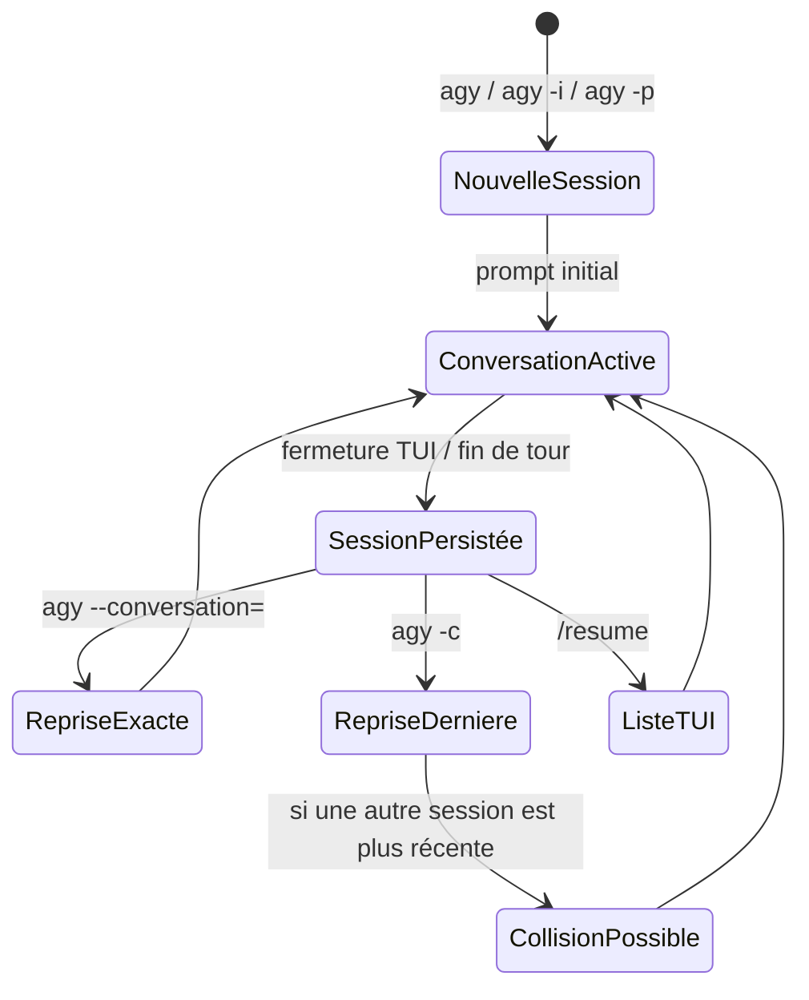

# Recherche approfondie sur Google Antigravity CLI en mode non interactif

## Résumé exécutif

Au 24 mai 2026, **Antigravity CLI** (`agy`) est bien positionné par Google comme l’interface terminale « terminal-first » d’Antigravity, avec un **mode headless / print** pensé pour l’automatisation, le piping et le CI/CD. Officiellement, le CLI partage le même moteur d’agent que l’application Antigravity 2.0 et synchronise l’authentification, le contexte et certaines configurations avec l’écosystème Antigravity. citeturn1view1turn7view0turn1view4

En revanche, **la surface publique réellement documentée pour le non-interactif reste incomplète**. Les sources publiques confirment `-p/--print`, `-i/--prompt-interactive`, `--conversation=<uuid>`, `-c`, `--print-timeout`, `--dangerously-skip-permissions`, `--sandbox`, ainsi que l’existence observée de `--add-dir` et `--log-file`. Je **n’ai pas trouvé** de documentation publique fiable pour des équivalents de `--json`, `--list-sessions`, `--all`, `--resume <id>` ou `--acp`; au contraire, plusieurs tickets communautaires demandent explicitement ces fonctions, ce qui indique qu’elles sont absentes ou au minimum non exposées publiquement aujourd’hui. citeturn74search0turn15view1turn75search0turn94search0turn72search1turn52search0

Côté sessions, le **comportement important** est le suivant : à la fermeture, AGY imprime une **commande de reprise explicite** du type `agy --conversation=<uuid>`; l’interface TUI permet aussi `/resume` pour lister et reprendre des conversations; mais le raccourci `-c` reprend simplement **la conversation la plus récente**, et des expérimentations communautaires montrent que cette « plus récente » est **globale à la machine**, pas propre au dépôt courant. Cela signifie que, pour les workflows multi-répertoires ou multi-repos, **l’unique reprise déterministe est `--conversation=<uuid>`**. citeturn49search0turn78view0turn93search0turn75search0turn94search0

Sur les identifiants eux-mêmes, Google ne documente pas l’algorithme de génération. Les exemples publics montrent des IDs au **format UUID** et des artefacts stockés localement sous des répertoires UUID-like. Les docs UI/workspaces montrent en outre que les conversations sont navigables **à travers les workspaces**, ce qui suggère que l’identité de session est plus proche d’une **conversation globale rattachée à un workspace** que d’un simple « pointeur vers le répertoire courant ». Mais la sémantique exacte inter-repo n’est pas formellement documentée. citeturn78view0turn77search0turn94search1turn94search0

Enfin, la configuration est aujourd’hui **morcelée** : `~/.gemini/antigravity-cli/settings.json` pour les réglages CLI, `~/.gemini/antigravity-cli/keybindings.json` pour les raccourcis, des fichiers de personnalisation sous `~/.gemini/config/` et des emplacements workspace-local sous `.agents/` ou `_agents/`. Pour MCP, les sources publiques sont **incohérentes** entre `~/.gemini/antigravity/mcp_config.json`, `~/.gemini/config/mcp_config.json` et l’ancien `~/.gemini/antigravity-cli/mcp_config.json`; en plus, un ticket montre que le fichier projet-local `.antigravitycli/mcp_config.json` est détecté mais que son bloc `mcpServers` est ignoré en pratique dans AGY 1.0.0. citeturn33search3turn57search0turn55search0turn32search0turn14view2turn52search4turn18view0turn38search0turn40search0turn42search0

## Surface non interactive confirmée

Google présente Antigravity CLI comme un CLI adapté aux workflows terminal et **headless mode**, « ideal for piping output, CI/CD integration, and automation scripts ». En pratique, la surface publiquement vérifiable est plus restreinte que cette promesse marketing : la documentation et les issues convergent vers quelques drapeaux centraux, avec plusieurs absences notables pour l’orchestration machine-à-machine. citeturn1view1turn74search0turn15view1

| Surface | Statut | Comportement confirmé | Exemple court | Sources |
|---|---|---|---|---|
| `agy` | officiel | Lance la TUI par défaut | `agy` | citeturn7view0turn74search0 |
| `agy --version` | officiel | Affiche la version | `agy --version` | citeturn13search1turn14view1 |
| `agy --help` | officiel | Drapeau d’aide présent; sur Windows 1.0.0, le banner passe par stderr | `agy --help` | citeturn52search0turn15view2 |
| `-p`, `--print` | confirmé | Mode non interactif « single block »; nouvelle conversation à chaque invocation selon issue ACP | `agy -p "Dis bonjour"` | citeturn74search0turn15view1turn72search0 |
| `-i`, `--prompt-interactive` | confirmé | Mode interactif lancé avec prompt initial; conserve streaming, approbations, annulation et état de conversation | `agy -i "Analyse ce repo"` | citeturn74search0 |
| `--print-timeout <durée>` | observé | Timeout explicite pour `--print` | `agy --print-timeout 30s -p "PONG"` | citeturn15view1turn72search0 |
| `--dangerously-skip-permissions` | confirmé | Auto-approbation agressive; dangereux en non-interactif | `agy --dangerously-skip-permissions -p "..."` | citeturn15view1turn72search0turn17search2 |
| `--sandbox` | confirmé | Restreint surtout terminal/shell; **pas** une barrière complète pour `write_file` selon expériences communautaires | `agy --sandbox -p "..."` | citeturn72search0turn17search2 |
| `--conversation=<uuid>` | confirmé | Reprend une conversation spécifique lorsqu’on connaît son ID | `agy --conversation=bbb2048c-...` | citeturn78view0turn94search0 |
| `-c` | confirmé | Reprend la conversation la plus récente; non déterministe en multi-sessions | `agy -c` | citeturn78view0turn93search0turn94search0 |
| `--add-dir <path>` | observé | Drapeau existant, utilisé avec `--print`; sémantique détaillée insuffisamment documentée publiquement | `agy --add-dir . --print "Hello"` | citeturn72search1 |
| `--log-file <path>` | observé | Drapeau existant; en 1.0.0, logs jugés incomplets par un ticket Windows | `agy --log-file agy.log` | citeturn52search0turn93search4 |
| `agy plugin import gemini` | confirmé | Sous-commande de migration / import de plugin Gemini | `agy plugin import gemini` | citeturn69search1turn58search2 |
| `agy plugin uninstall <nom>` | confirmé | Supprime le plugin; un ticket note que cela supprime le dossier disque, pas seulement l’enregistrement | `agy plugin uninstall my-plugin` | citeturn69search1turn58search2 |

Je **n’ai pas trouvé** dans les sources publiques consultées de syntaxe fiable pour `--resume <id>`, `--all`, `--json`, `--output <path>`, `--list-sessions` ou `--acp`. Au contraire, la doc officielle indexée renvoie vers **`/resume` dans la TUI** pour lister les conversations, tandis que des tickets demandent explicitement `--json`, `--output`, `--acp` ou l’exposition d’un identifiant de session en headless. citeturn75search0turn94search2turn15view1turn74search0turn94search0

Pour les variables d’environnement, je n’ai trouvé **aucune variable officiellement documentée** pour piloter les sessions ou le mode non interactif d’AGY. Les variables `env` existent dans les **schémas de config** MCP/sidecars pour les processus lancés par AGY, mais pas comme interface CLI officielle de gestion de session. Les seules variables liées à l’auth vues dans les tickets sont **internes, ignorées ou proposées** (`JETSKI_OAUTH_TOKEN`, `JETSKI_TEST_GAIA_TOKEN`, `AGY_OAUTH_TOKEN`, `GEMINI_API_KEY`, `ANTIGRAVITY_API_KEY`) et ne doivent pas être considérées comme supportées aujourd’hui. citeturn53search0turn53search1turn52search6turn17search12

## Politique des sessions et des identifiants

Sur le plan officiel, AGY **auto-sauvegarde** l’état de conversation et, à la fermeture, affiche la commande exacte permettant de reprendre **cette session précise**. La doc utilisateur indexée mentionne explicitement cet auto-save resume, et un billet Google Cloud Community montre la sortie concrète : `Resume: agy --conversation=<uuid> (or -c)`. citeturn49search0turn78view0turn93search0

Ce qui est **documenté avec un bon niveau de confiance** :

| Question | Réponse | Niveau de confiance | Sources |
|---|---|---|---|
| Comment reprendre une session exacte ? | Avec `agy --conversation=<uuid>` quand l’ID est connu | élevé | citeturn78view0turn94search0 |
| Comment reprendre la dernière session ? | Avec `agy -c` | élevé | citeturn78view0turn93search0turn94search0 |
| Comment lister des conversations ? | Via `/resume` dans la TUI; la doc dit « list and resume previous conversation logs » | élevé | citeturn75search0turn94search2 |
| Les IDs sont-ils documentés ? | Non; on observe seulement un format UUID-like | moyen | citeturn78view0turn93search0 |
| `-p` garde-t-il l’état entre invocations ? | Non, d’après le ticket ACP : « New each invocation » | élevé | citeturn74search0 |
| `-c` est-il limité au dépôt courant ? | Non, des tickets indiquent qu’il reprend la plus récente **globalement sur la machine** | élevé | citeturn94search0turn70search0 |

Le point le plus important pour votre question « répertoire/repo/worktree ou workspace ? » est le suivant : **du point de vue du produit, les conversations sont rattachées à des workspaces**, et l’UI sait basculer « across workspaces ». Mais en mode CLI headless, **la reprise par raccourci `-c` n’est pas repo-scopée** : la communauté a observé qu’elle reprend la plus récente au niveau machine, ce qui crée des collisions entre wrappers ou répertoires différents. En d’autres termes, les sessions ne se comportent **pas** comme des identifiants strictement liés au dépôt courant. Elles sont plus proches d’objets de conversation/workspace globaux, avec une reprise non déterministe tant que vous n’utilisez pas l’UUID explicite. citeturn77search0turn94search1turn94search0

Sur la **génération** des IDs, je n’ai trouvé **aucune documentation officielle** expliquant l’algorithme. Les exemples publics montrent des identifiants au format UUID classique, et les artefacts/brains locaux utilisent eux aussi des répertoires UUID-like sous `~/.gemini/antigravity-cli/brain/<uuid>/...`. Il est donc raisonnable de parler d’IDs **UUID-format observés**, mais pas de « UUID v4 officiellement garantis ». citeturn78view0turn93search0

Sur la **visibilité inter-répertoires**, les preuves sont partielles mais cohérentes : la doc produit dit que l’on peut naviguer entre conversations à travers les workspaces; la TUI `/resume` liste d’anciens journaux; `-c` reprend globalement la plus récente; et un ticket mentionne des fichiers symlinkés « per-workspace » sous `~/.antigravitycli/`, tout en soulignant leur caractère non documenté. La conclusion la plus rigoureuse est donc : **oui, une session AGY n’est pas enfermée par design dans un seul repo**, mais **la seule méthode fiable et supportée publiquement pour la faire voyager est `--conversation=<uuid>`**, pas `-c`, et la garantie exacte inter-repo reste sous-documentée. citeturn77search0turn94search1turn94search0



Le diagramme ci-dessus synthétise ce que les sources publiques décrivent et observent : **la reprise exacte passe par l’UUID**, alors que **`-c` est un raccourci opportuniste** et potentiellement ambigu en environnement multi-sessions. citeturn49search0turn78view0turn94search0

Sur la **persistance** et la confidentialité, AGY stocke des réglages et des logs sous `~/.gemini/antigravity-cli/`, conserve des artefacts dans `brain/<uuid>/...`, et authentifie le CLI via le **system keyring** avec fallback Google Sign-In. Google avertit par ailleurs des risques classiques des agents de code — exécution autonome, exfiltration, prompt injection, supply chain — et indique que les interactions peuvent être collectées pour améliorer le produit, avec opt-out via les réglages. Cela implique qu’un journal local de session, des artefacts et parfois des traces de configuration peuvent rester sur disque; les identifiants d’auth, eux, sont plutôt censés vivre dans le keyring OS que dans un simple fichier texte. citeturn7view0turn14view3turn78view0

## Fichiers de configuration et schémas

La documentation officielle indexée présente Antigravity avec une **architecture hiérarchique** de réglages, séparant **préférences globales** et **frontières de projet / workspace**. En pratique, cela se traduit par un mélange de fichiers purement CLI, de fichiers de personnalisation globaux sous `~/.gemini/config/` et de fichiers workspace-local sous `.agents/`, `_agents/` ou `.antigravitycli/`. citeturn55search0turn80search0

### Emplacements et précédence

| Fichier / dossier | Rôle | Emplacement confirmé | Portée | Précédence / remarques |
|---|---|---|---|---|
| `settings.json` | Réglages CLI principaux | `~/.gemini/antigravity-cli/settings.json` | global utilisateur | Source principale confirmée pour le CLI; certaines options sont aussi modifiables via `/config` / `/settings` | citeturn33search3turn26search0 |
| `keybindings.json` | Raccourcis clavier CLI | `~/.gemini/antigravity-cli/keybindings.json` | global utilisateur | Si supprimé, retour aux défauts | citeturn57search0 |
| `hooks.json` | Hooks / automatisations | répertoire de personnalisation, p. ex. `.agents/` dans le workspace ou `~/.gemini/config/` | workspace-local ou global | la doc situe les hooks dans la customization dir; un ticket Windows signale un bug de chemin entre `~/.gemini/config/hooks.json` et `~/.gemini/antigravity-cli/hooks.json` | citeturn42search0turn18view0 |
| `mcp_config.json` | Déclaration de serveurs MCP | doc indexée : `~/.gemini/antigravity/mcp_config.json`; issues : `~/.gemini/config/mcp_config.json` ou ancien `~/.gemini/antigravity-cli/mcp_config.json` | global utilisateur | **incohérence documentaire**; un ticket parle même d’un symlink legacy | citeturn32search0turn14view2turn52search4 |
| `.antigravitycli/mcp_config.json` | Config MCP projet-local / metadata de projet | `<workdir>/.antigravitycli/mcp_config.json` | repo / workspace | détecté au démarrage, mais `mcpServers` observé comme ignoré en 1.0.0 | citeturn14view2turn52search4 |
| `plugin.json` | Manifeste de plugin | workspace: `.agents/plugins/` ou `_agents/plugins/`; global: `~/.gemini/config/plugins/` | workspace ou global | `plugin.json` est requis comme marqueur du plugin | citeturn38search0turn34search0turn44search0 |
| `sidecar.json` | Déclaration de sidecar | global `~/.gemini/config/sidecars/`; plugins `~/.gemini/config/plugins/<pluginName>/sidecars/` | global ou lié au plugin | pas d’emplacement workspace-local indexé dans le snippet consulté | citeturn40search0 |

Deux enseignements pratiques en découlent. D’abord, **il n’existe pas un seul “repo config file” universel** pour AGY : selon la fonctionnalité, vous jonglez entre `settings.json`, `mcp_config.json`, `hooks.json`, `plugin.json`, `sidecar.json` et des dossiers `.agents/` / `.antigravitycli/`. Ensuite, la **précédence réelle** de certains fichiers locaux n’est pas entièrement fiable aujourd’hui : le cas le plus net est `.antigravitycli/mcp_config.json`, reconnu par AGY mais dont le bloc `mcpServers` est rapporté comme non appliqué. citeturn55search0turn14view2turn52search4

### Schémas vérifiés

Le schéma public de `settings.json` n’est **pas publié intégralement** dans les sources textuelles consultées. Les clés que j’ai pu vérifier avec un bon niveau de confiance sont les suivantes :

| Clé | Type | Valeurs / forme observées | Défaut connu | Commentaire |
|---|---|---|---|---|
| `colorScheme` | chaîne | ex. `"dark"` | non documenté textuellement; le changelog 1.0.1 dit que le thème **terminal** devient le choix par défaut proposé en onboarding | vérifié par exemple de fichier | citeturn26search0turn95view0 |
| `model` | chaîne | ex. `"Gemini 3.5 Flash (High)"`; la liste vue inclut Gemini 3.5 Flash, Gemini 3.1 Pro, Claude 4.6, GPT-OSS 120B | non documenté textuellement | stocke le modèle sélectionné | citeturn26search0turn78view0 |
| `statusLine` | objet | `{ "type": "", "command": "", "enabled": true }` | sample: `enabled: true` | structure observée dans un exemple public | citeturn26search0 |
| `trustedWorkspaces` | tableau de chaînes | chemins absolus de dossiers approuvés | non documenté textuellement | liste des workspaces « trusted » | citeturn26search0 |
| `permissions.allow` | tableau de chaînes | ex. `command(git)`, `command(npm test)` | non documenté textuellement | doc officielle sur permissions granulaires | citeturn86search0turn87search0turn87search1 |
| `permissions.deny` | tableau de chaînes | patterns de ressources / commandes | non documenté textuellement | mentionné dans les exemples de permissions | citeturn86search0turn87search2 |
| mode d’autonomie / permissions | clé exacte non visible dans l’index consulté | `request-review`, `always-proceed`, `strict`; `proceed-in-sandbox` ajouté en 1.0.1 | `request-review` dans le billet communautaire | la **clé JSON exacte** n’est pas visible dans les snippets indexés | citeturn89search0turn26search0turn95view0 |

Pour **MCP**, le schéma public est mieux visible, mais avec une **ambiguïté de casse** sur la clé URL :

| Clé MCP | Type | Valeurs / forme observées | Commentaire |
|---|---|---|---|
| `mcpServers` | objet | map nom → config serveur | top-level confirmé |
| `command` | chaîne | exécutable stdio | pour serveurs locaux |
| `args` | tableau de chaînes | arguments du processus | pour stdio |
| `env` | objet | variables d’environnement du processus servidor | pour stdio |
| `cwd` | chaîne | répertoire de travail | pour stdio |
| `serverUrl` | chaîne | URL serveur distant | **doc indexée** |
| `serverURL` | chaîne | URL serveur distant | **runtime observé dans une issue**; `url` Gemini est rejeté |
| `headers` | objet | en-têtes HTTP personnalisés | pour serveurs distants |
| `authProviderType` | chaîne | `"google_credentials"` supporté pour ADC | doc indexée |
| `oauth` | objet | contient au moins `clientId`, `clientSecret` côté doc; des tickets parlent aussi de tokens | support runtime partiel litigieux |
| `disabled` | booléen | `true` / `false` | désactivation temporaire sans suppression |

Ces clés proviennent des snippets officiels et des reports de tests sur le runtime. La prudence importante ici est la suivante : **la doc indexée parle de `serverUrl`, mais des expérimentations runtime montrent `serverURL`** et l’erreur « `serverURL or command must be specified` ». Pour un usage réel, il faut donc tester la casse sur votre version précise. citeturn59search0turn61search0turn62search0turn63search0turn52search3

Exemple de `settings.json` **raisonnable et vérifié partiellement** :

```json
{
  "colorScheme": "dark",
  "model": "Gemini 3.5 Flash (High)",
  "statusLine": {
    "type": "",
    "command": "",
    "enabled": true
  },
  "trustedWorkspaces": [
    "/home/user/projets/mon-repo"
  ],
  "permissions": {
    "allow": [
      "command(git)",
      "command(npm run (build|lint|test))"
    ],
    "deny": [
      "unsandboxed(git push)"
    ]
  }
}
```

Ce fichier combine l’exemple public de `settings.json` et les exemples officiels de permissions granulaires. La clé exacte du mode d’autonomie n’est pas visible dans les sources textuelles indexées, donc je n’en ajoute pas ici de façon spéculative. citeturn26search0turn86search0turn87search1

Exemple de `mcp_config.json` **compatible avec ce qui est publiquement visible**, à ajuster selon votre version pour `serverUrl`/`serverURL` :

```json
{
  "mcpServers": {
    "local-tools": {
      "command": "python3",
      "args": ["server.py"],
      "env": {
        "PROJECT_LOCAL_PROBE": "yes"
      },
      "cwd": "/home/user/projets/mon-repo",
      "disabled": false
    },
    "remote-tools": {
      "serverURL": "https://example.com/mcp/",
      "headers": {
        "X-Org": "demo"
      },
      "authProviderType": "google_credentials",
      "oauth": {
        "clientId": "demo-client-id",
        "clientSecret": "demo-client-secret"
      },
      "disabled": false
    }
  }
}
```

La structure `mcpServers` et les champs `command/args/env/cwd/headers/authProviderType/oauth/disabled` sont confirmés par les snippets publics, mais la prise en charge effective d’OAuth HTTP et la casse exacte de l’URL restent litigieuses selon les tickets consultés. citeturn59search0turn61search0turn62search0turn63search0turn52search3

## Écarts entre TUI et mode non interactif

La différence la plus nette entre la **TUI interactive** et le **non-interactif** n’est pas cosmétique : elle touche directement la sécurité, la reprise, le streaming, et l’intégrabilité.

| Surface | Streaming | Approbation outillée | Annulation | État de conversation | Lister/reprendre sessions |
|---|---|---|---|---|---|
| TUI par défaut | oui | oui | oui | oui | oui, via `/resume` |
| `-i / --prompt-interactive` | oui | oui | oui | oui | oui, puisqu’on reste en interactif |
| `-p / --print` | non, bloc unique | non, sauf logique liée au skip-permissions; en pratique des tickets observent auto-approbation | non | non, « new each invocation » | non; pas de liste publique documentée |

Ce tableau provient principalement du ticket ACP, recoupé par les tickets sur `-p` et par la doc `/resume`. Il décrit bien l’état de la surface publique au lancement d’AGY 1.0.x. citeturn74search0turn75search0turn72search0

Le point le plus sensible est que **`-p` n’est pas un “mode lecture seule”**. Un ticket détaillé montre qu’en headless `-p`, AGY peut auto-approuver des appels outillés, y compris `write_file`; un autre montre que `--sandbox` ne protège que partiellement, surtout pour le shell, et qu’avec `--dangerously-skip-permissions` le bypass sandbox peut devenir effectif. Si vous venez de Gemini CLI, c’est un changement important : le vieux `--approval-mode plan` n’a pas d’équivalent confirmé ici pour le non-interactif. citeturn72search0turn17search2

Le second écart majeur est la **sortie machine-readable**. Google présente headless mode comme compatible piping/CI, mais des tickets sur 1.0.0 montrent un comportement problématique sur Windows/non-TTY : `--print` peut produire zéro octet sur stdout tout en complétant réellement un tour modèle, et plusieurs utilisateurs demandent une sortie `--json`, `--output` ou ACP. Le changelog 1.0.1 dit avoir corrigé des problèmes de redirection de logs et de redimensionnement sur Windows, mais je n’ai pas trouvé de preuve textuelle officielle que cela résout **à lui seul** toute la capture stdout de `--print` en non-TTY. citeturn1view1turn15view1turn52search0turn95view0

```mermaid
flowchart TD
    A[Invocation AGY] --> B{Mode}
    B -->|TUI / -i| C[/resume disponible]
    B -->|-p / --print| D[Pas de liste de sessions documentée]
    C --> E{A-t-on l'UUID exact ?}
    D --> E
    E -->|Oui| F[agy --conversation=<uuid>]
    E -->|Non| G{Veut-on juste la dernière session ?}
    G -->|Oui| H[agy -c]
    G -->|Non| I[Ouvrir la TUI puis /resume]
    H --> J[Attention: comportement global machine]
    F --> K[Reprise ciblée]
    I --> K
```

Ce flux est la représentation la plus fidèle des sources consultées : **UUID exact si vous voulez une reprise déterministe**, **`-c` seulement si “la dernière session globale” vous convient**, et **TUI `/resume`** si vous devez lister/humainement choisir. citeturn94search0turn94search2turn78view0

## Recettes opératoires

### Lister les sessions

La méthode **officiellement documentée** est en TUI :

```bash
agy
# puis, dans la TUI :
/resume
```

La documentation indexée décrit `/resume` comme la commande qui « list and resume previous conversation logs ». Je n’ai pas trouvé de `agy --list-sessions` ou équivalent shell public. citeturn75search0turn94search2

Si vous redémarrez `agy` dans le même workspace, la TUI peut aussi vous présenter directement un picker de conversations récentes. Un ticket Windows montre par exemple l’écran de conversations avec recherche et sélection, après avoir relancé `agy`. citeturn93search0

### Reprendre une session précise par ID

Quand vous avez l’ID :

```bash
agy --conversation=bbb2048c-7de6-4dd5-ba7e-8b0c27d46b95
```

C’est la forme la plus sûre et la plus précise visible publiquement. Elle est imprimée par AGY à la fermeture dans les exemples publics. citeturn78view0turn93search0

### Reprendre simplement la plus récente

```bash
agy -c
```

Cette commande est pratique, mais **dangereuse dès que vous avez plusieurs fils de conversation** actifs, plusieurs wrappers, ou plusieurs répertoires. Des tickets indiquent clairement que `-c` repart de **la plus récente globalement sur la machine**, pas forcément celle du repo courant. citeturn78view0turn94search0

### Extraire l’ID de session dans un journal persistant

AGY n’expose pas aujourd’hui de sortie JSON/documentée pour renvoyer l’ID de session en headless. La méthode la plus robuste est donc de **capturer le transcript terminal** puis d’extraire la ligne de reprise imprimée à la fermeture. Les sources publiques montrent des sorties du type `Resume: agy --conversation=<uuid> (or -c)` ou `Resume with: agy --conversation=<uuid>`. citeturn78view0turn93search0

Sous Linux ou macOS :

```bash
script -q agy-transcript.txt
agy
# ... travailler ...
exit

grep -Eo 'agy --conversation=[0-9a-f-]+' agy-transcript.txt
```

Sous PowerShell :

```powershell
Start-Transcript -Path .\agy-transcript.txt
agy
# ... travailler ...
Stop-Transcript

Select-String -Path .\agy-transcript.txt -Pattern 'agy --conversation='
```

Cette approche contourne le fait que **`--json` n’est pas documenté** et que la capture stdout de `--print` a été problématique au moins sur certaines versions / certains environnements Windows non-TTY. citeturn15view1turn52search0turn95view0

### Persister un journal de session en non interactif

Pour un assistant batch, le plus simple reste :

```bash
agy --print-timeout 60s -p "Analyse ce dépôt et résume les changements"
```

Mais si vous avez besoin d’un journal **fiable**, n’assumez pas encore qu’un simple `> out.txt` sera toujours portable ou machine-friendly, surtout si vous êtes sur AGY 1.0.0/Windows. Préférez un transcript de terminal ou testez explicitement sur votre version. citeturn15view1turn52search0turn95view0

### Reprendre une session à travers deux répertoires ou deux repos

La recette **la plus plausible et la plus prudente** est :

```bash
cd /chemin/vers/autre-repo
agy --conversation=<UUID_DE_LA_SESSION>
```

Ce que les sources permettent d’affirmer rigoureusement, c’est que :  
d’une part AGY sait naviguer entre conversations **across workspaces** côté produit; d’autre part `-c` est global machine; et enfin `--conversation=<uuid>` reprend une session spécifique si l’ID est connu. En revanche, je n’ai trouvé **aucun texte officiel qui garantisse explicitement** la sémantique « cross-repo » de `--conversation=<uuid>` ni la façon dont AGY réconcilie ce contexte avec le workspace courant. En pratique, il faut s’attendre à un **prompt de trust / permissions** si le nouveau répertoire n’est pas déjà approuvé, et il faut tester ce flux dans vos environnements critiques. citeturn77search0turn94search1turn94search0turn26search0

### Utiliser plusieurs repos additionnels

Un ticket montre l’usage réel du drapeau suivant :

```bash
agy --add-dir . --print "Reply with exactly 'Hello World'"
```

Son existence est confirmée, mais je n’ai pas trouvé la documentation publique textuelle détaillant sa sémantique exacte, ses règles de sécurité ou son interaction avec `--conversation`. Je le traiterais donc comme un drapeau **réel mais sous-documenté**. citeturn72search1

## Questions ouvertes et limites

La principale limite documentaire est qu’**il n’existe pas, dans les sources textuelles indexées que j’ai pu consulter, une page `--help` exhaustive et stable** couvrant toute la CLI non interactive. Cela force à combiner documentation officielle, README, changelog et tickets GitHub publics. citeturn7view0turn95view0turn94search0

Les points qui restent **non documentés ou ambigus** sont les suivants :

| Point | État actuel |
|---|---|
| Algorithme exact de génération des session IDs | non documenté; seulement des UUID-like observés |
| Garantie officielle qu’un `--conversation=<uuid>` fonctionne proprement **entre deux repos** | non trouvée |
| Commande shell officielle pour lister les sessions (`--list-sessions`, `--all`) | non trouvée; la voie documentée reste `/resume` dans la TUI |
| Sortie JSON / machine-readable officielle pour `--print` | non trouvée; plusieurs tickets la demandent explicitement |
| Casse exacte de la clé URL MCP (`serverUrl` vs `serverURL`) | incohérente entre snippets docs et runtime observé |
| Précédence réelle entre `~/.gemini/config/mcp_config.json` et `.antigravitycli/mcp_config.json` | partiellement cassée/indéterminée publiquement; ticket 1.0.0 signale que le local est détecté mais ignoré pour `mcpServers` |
| Nom exact de la clé JSON qui persiste le mode d’autonomie / permission dans `settings.json` | non visible dans les snippets indexés, même si les valeurs (`request-review`, `always-proceed`, `strict`, `proceed-in-sandbox`) sont identifiables |

Ces zones grises ne sont pas anecdotiques : elles touchent précisément les usages d’orchestration, CI, wrappers multi-sessions et workflows cross-repo que vous ciblez. La conclusion opérationnelle la plus solide est donc la suivante : **pour l’instant, ne basez pas un orchestrateur robuste sur `-c`, sur une hypothèse repo-scopée des sessions, ni sur une sortie JSON inexistante**. Si vous devez automatiser sérieusement AGY aujourd’hui, utilisez **`--conversation=<uuid>`**, conservez l’UUID hors du process AGY, et prévoyez des tests spécifiques par OS/version, surtout sur Windows et WSL. citeturn94search0turn75search0turn15view1turn36search21turn14view3